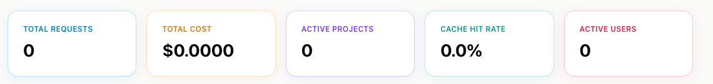
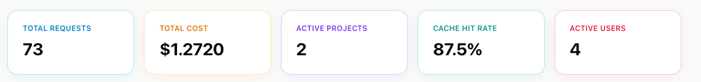

# AxonLLM

[](https://github.com/AxonLLM/axonllm/actions/workflows/ci.yml)
[](LICENSE)
[](https://www.python.org/downloads/)

**The neural control plane for enterprise LLMs.**

One API, any provider. Smart routing picks the best model for each prompt. Ensemble mode dispatches to multiple models and synthesizes a better answer. Policy-driven security, PII redaction, quota enforcement, and multi-region failover — all in one place.

```bash
git clone https://github.com/AxonLLM/axonllm.git
cd axonllm
cp -n config/providers.yaml.example config/providers.yaml
# Add at least one API key (or just use Bedrock with AWS credentials)
docker compose run --rm --service-ports \
  -e AXON_DEPLOYMENT_PROFILE=development \
  -e AXON_REQUIRE_CANONICAL_IDENTITY=false \
  -e AXON_AUTH_MODE=LOG_ONLY \
  axonllm                   # needs the Docker daemon running
# Open http://localhost:8000 — the landing page, with the dashboard one click away
# (or go straight to http://localhost:8000/admin/dashboard)
```

Already running something on 8000? Use
`AXON_HOST_PORT=8002 docker compose up`. Worth knowing because the clash does not announce
itself: Docker binds `::` while a local `serve_dashboard.py` binds `0.0.0.0`,
so both start, and `localhost` then resolves to `::1` first — the container
answers and the gateway you started by hand goes quietly unreachable.

No Docker? Use [path 1 or 2](#quick-start) below, which need only Python and uv.

This comes up **with the demo data seeded** (Acme Corp, 3 users, 66 usage
records) and auth in `LOG_ONLY`, which is what you want for a first look and not
what you want anywhere else. [Quick Start](#quick-start) covers the four
install paths — local or AWS, seeded or clean — and which flag decides.

## Why AxonLLM?

| Problem | AxonLLM Solution |
|---------|-----------------|
| Teams call LLM providers directly — no visibility, no control | Single gateway with full observability |
| One model doesn't fit all prompts | Smart routing classifies prompts and picks the optimal model |
| Single-model quality ceiling | Ensemble dispatches to N models + judge synthesizes the best answer |
| LLM costs grow unchecked | Hierarchy-driven budgets (org→BU→project→env) that block before overspend |
| No guardrails on what goes to/from models | PII redaction, prompt injection detection, content filtering |
| Provider outages break everything | Multi-region hub-and-spoke with automatic failover |
| Compliance gaps | Immutable audit trail with SHA-256 hash chain |

## Features

### Routing & Providers
- **Multi-provider routing** — 13 provider adapters: Bedrock, Bedrock Mantle, Anthropic, OpenAI, Azure, Vertex AI, Google AI, Cohere, AI21, Fireworks, Groq, Together, xAI
- **Tool calling (function calling)** — send OpenAI-shaped `tools`/`tool_choice`; each adapter translates into its provider's own dialect (Anthropic `input_schema`, Bedrock `toolSpec`, Gemini `functionDeclarations`, Cohere `parameter_definitions`) and translates the call back. One tool definition works across every provider.
- **5 routing strategies** — round-robin, weighted, least-latency, cost-optimized, smart (intent-aware)
- **Ensemble routing** — scatter-gather-synthesize across a panel of models with configurable quorum
- **Multi-region hub-and-spoke** — single-region, active-passive failover, or active-active with weighted distribution
- **Data residency** — strict mode filters spokes by zone to keep data in-region

### Security & Compliance
- **PII redaction** — per-policy-node, regex-based detection across 10 types (email, SSN, credit card, phone, IPv4, IPv6, AWS account id, medical record, IBAN, passport). Redacts before the LLM sees the prompt, re-injects in the response. The type list is a policy choice per node, not a fixed default — `aws_account_id` matches any bare 12-digit number and `passport` any letter followed by 6–9 digits, so both fire on ordinary identifiers and are usually left off.
- **Named-entity redaction (opt-in)** — adds AWS Comprehend detection for the shapeless types regex cannot match: names, addresses, ages. Per-node via `pii_ner_enabled`, and billed per request (~$0.0001/100 chars, often more than the model's own input tokens), so it is off by default. Fails open: a Comprehend error leaves the regex types redacted and reports the failure rather than blocking the request.
- **Prompt injection detection** — pattern-scored heuristics (role override, system-prompt extraction, delimiter escape, base64-encoded payloads). Blocking threshold configurable, defaults to 0.7.
- **Immutable audit trail** — SHA-256 hash chain, DynamoDB persistence, tamper detection
- **Durable event dispatcher** — tenant-scoped webhook, AWS SNS, and CloudWatch
  Logs delivery through a FIFO SQS outbox with bounded retries, native DLQ
  redrive, deterministic idempotency keys, and managed AWS destination
  allowlists.

### Caching & Cost Reduction
- **Exact response cache** — SHA-256 of the request, tenant/project namespace,
  and per-project TTL.
- **Semantic cache (opt-in)** — serves a cached answer to a *reworded* question, tried only after the exact key misses. Off unless a project enables it, because a false hit returns a confident wrong answer with nothing to indicate it was substituted. Guarded four ways: a 0.90 cosine threshold (set for its distance from the highest-scoring *different*-question pair at 0.7476, not for a target hit rate), exact agreement on literal tokens so `17*23` never matches `17*24`, polar-axis comparison so "enable" never matches "disable", and skipping non-zero temperature, tool calls and streaming outright. Needs Bedrock for Titan embeddings.
- **Token efficiency analytics** — flags waste, recommends cheaper models, scores prompt quality.
- **Semantic efficiency engine** — prompt-complexity scoring and model right-sizing, output-utilization analysis (are responses truncated or ignored?), prompt-compression detection, and per-user historical pattern learning. Surfaces on the Efficiency page.

### Governance & Cost Control
- **Policy hierarchy** — org → business unit → project → environment. Child inherits and can only tighten.
- **Quota enforcement** — rate limit (RPM), budget limit, max tokens, allowed models, allowed providers. All derived from the hierarchy.
- **Budget threshold alerting** — fires events at 80%, 90%, 100% spend via the event dispatcher
- **Per-user and per-project budgets** with automatic blocking

### Identity & Access
- **Multi-strategy auth** — ALB OIDC JWT, Bearer token (OIDC or API key), X-Api-Key header
- **Canonical tenant identity** — replaces credential-provided roles, scopes,
  status, and project grants with strongly consistent server-held DynamoDB
  principals. Canonical requests require explicit tenant and project context;
  cross-tenant and ungranted resources are concealed as 404 and authority-store
  failures return 503.
- **Tenant admin and viewer RBAC** — `tenant_admin` can read and write
  tenant-owned configuration. `tenant_member` and `tenant_auditor` are the
  read-only/viewer roles. All three still need an explicit project grant for
  model listing, inference, and the reserved `query.select` action. Canonical
  `service` identities have no control-plane access and additionally need
  server-held data-plane action scopes. Legacy `admin` and `admin:*`
  compatibility applies only to noncanonical migration contexts; canonical
  service and viewer identities cannot use it to elevate. Platform-resource
  writes and region topology require `platform_admin`; tenant control-plane
  access by that role requires both a break-glass reason and an explicit
  `X-Axon-Target-Tenant` selector.
- **SAML 2.0 SSO** — SP-initiated login + ACS with pure-Python signed-assertion verification (no xmlsec1 system dependency)
- **SCIM 2.0 provisioning** — `/scim/v2/Users` + `/scim/v2/Groups` for IdP-driven joiner/mover/leaver (Okta, Entra ID, …)
- **API key management** — canonical issue, revoke, and rotation transactionally
  update tenant-qualified key and service-principal records. Tenant keys default
  to 90 days and cannot exceed 365 days. Legacy/in-memory rotation remains
  revoke then issue.
- **Tenant-scoped control plane** — projects, usage/spend, user configuration,
  policies, quotas, webhooks, audit chains, caches, API keys, and SCIM records
  use tenant-qualified paths when a canonical tenant context is present. Legacy
  unqualified records and `admin`/`admin:*` authority remain migration
  compatibility.

Canonical mode default-denies every unmapped `/api/*` and `/v1/*` route.
`GET /api/users` is intentionally unavailable in that mode because its
selector aggregates users without a tenant filter and has no canonical action
mapping.

> **Current release status.** Focused hardening regressions are green locally,
> and schema-v2 release evidence plus target-aware deployment verification cover
> both Fargate and AgentCore. This is not production certification. Green
> required CI for the exact release commit, a real tagged private-ECR/Sigstore
> flow for the deployed digest, and a real AWS restore exercise remain
> externally unverified. See the
> [Production Runbook](docs/PRODUCTION_RUNBOOK.md#release-status) and
> [AgentCore Runbook](docs/AGENTCORE_RUNBOOK.md#current-status).

> **`query.select` is vocabulary, not an endpoint.** It is reserved in the
> authorization kernel for a future read-only query integration. AxonLLM ships
> no SQL parser, datasource adapter, query route, or backend query contract.
> `query.mutate` always denies.

### Observability
- **Admin dashboard** — 20 pages in four groups. *Observe:* Overview, Traces, Efficiency, Audit Log. *Configure:* Models, Projects, Users, API Keys. *Govern:* Policies, Hierarchy, Quotas, Regions, Webhooks. *System:* Health, Configuration, Architecture, Pricing, Catalogue, Readiness. Plus Sandbox, a live playground that issues real requests through the gateway.
- **Pricing coverage check** — flags models with no configured price, which bill at $0.00 and so silently under-count budgets. Reported at startup and on `/admin/pricing-drift`.
- **Production readiness checklist** — eight checks for misconfigurations that
  can otherwise serve traffic quietly: canonical identity, auth enforcement,
  demo data, provider credentials, pricing, model ids, persistence, and API-key
  expiry/scope posture. On `/admin/production-checklist`, production only.
- **Catalogue drift detection** — `models.yaml` decides what the router can dispatch to; `catalog.yaml` describes what those models are. They are edited independently and nothing cross-checks them, so drift is invisible because neither file is wrong on its own terms. Reports catalogue entries no mapping can reach, routed models with no capability description (which return `[]` — a silent "no" to "does this do vision", worse than a gap), and traffic naming models the registry does not list. On `/admin/catalog-drift`.
- **Streaming** — SSE streaming for all providers with PII re-injection
- **Trace forwarding** — each completed request can be forwarded as a trace event to an external control plane over HTTP or an in-process sink. Best-effort: a slow or absent collector never slows or fails a request.

## Supported Providers

Status means what has been *observed*, not what exists in the tree — every row
below has a complete adapter. **Verified** is a live completion through the
gateway. **Untested** means no credential was available to try it, which is not
evidence of a defect and not evidence against one.

| Provider | Auth | Status |
|----------|------|--------|
| AWS Bedrock | AWS credentials (automatic) | Verified |
| AWS Bedrock Mantle | AWS credentials (automatic) | Verified |
| Anthropic | API key | Verified |
| OpenAI | API key | Verified |
| xAI | API key | Verified |
| Together | API key | Verified |
| Fireworks | API key | Verified |
| Google AI (Gemini) | API key | Adapter ready — request timed out |
| AI21 | API key | Adapter ready — untested (no credential) |
| Groq | API key | Adapter ready — untested (no credential) |
| Azure OpenAI | API key | Adapter ready — untested (no credential) |
| Google Vertex AI | GCP service account | Adapter ready — untested (no credential) |
| Cohere | API key | Adapter ready — untested (no credential) |

## Quick Start

**Start locally for development. AWS promotion is an evidence-gated operation,
not a quick-start step.**

```
                      ┌─────────────────────────────┐
                      │  Where are you installing?  │
                      └──────────────┬──────────────┘
                ┌────────────────────┴────────────────────┐
                ▼                                         ▼
           Your laptop                               AWS account
                │                                         │
       ┌────────┴────────┐                                ▼
       ▼                 ▼                         Fargate / AgentCore
     Empty           Full demo                  immutable image digest
    gateway           seeded                    private network + state
       │                 │                                │
    PATH 1            PATH 2                           PATH 3
   development        a tour                 staging or approved release
     5 min             5 min                       release-gated
```

| | Where | Demo data | Auth | Time | Go to |
|---|-------|-----------|------|------|-------|
| **1** | Laptop | No — empty | `LOG_ONLY` | 5 min | [Local, clean](#1-local-clean) |
| **2** | Laptop | Yes — seeded | `LOG_ONLY` | 5 min | [Local, seeded demo](#2-local-seeded-demo) |
| **3** | AWS Fargate | No — empty | `ENFORCE`; staging uses legacy identity | Varies | [AWS Fargate](#3-aws-fargate) |

**Not sure? Start with path 2**, click around, then throw it away and use path 1
for development. Nothing in path 2 persists unless you enable DynamoDB.

Paths 1 and 3 leave you with an empty gateway, which then needs configuring:
provider keys, projects, authentication, and RBAC. That is
[Configuring a clean install](#configuring-a-clean-install), further down.

### Prerequisites

Python 3.11+ and [uv](https://docs.astral.sh/uv/). If you don't have uv:

```bash
curl -LsSf https://astral.sh/uv/install.sh | sh    # macOS / Linux
```

Every install path below uses `uv run`, which creates `.venv/` on first use and
installs from the committed `uv.lock` — so the versions you get are the versions
CI tested, and nothing touches your system Python.

> **Do not use bare `pip install -e ".[dev]"`.** Outside an activated virtualenv
> it installs into whatever Python is on your `PATH` and resolves dependencies to
> their *floors* — `httpx>=0.25.0` yields httpx 0.25.2, which is old enough to
> break unrelated packages sharing that environment. `uv run` cannot do this.

### What "demo data" actually means

This is the difference, on the same dashboard page:

**Clean install** — every tile zero. Nothing has happened yet, and the UI says so.



**Seeded demo** — Acme Corp, 2 projects, 3 users, 66 requests, $1.26 of spend, a
verifiable audit chain. **All of it fictional, and nothing on the page says so.**



That second screenshot is why the flag matters: seeded data is indistinguishable
from real usage, which makes it a good demo and a bad thing to leave running
where someone might mistake it for a live tenant.

### The two flags that drive all four paths

| Flag | Default | What it does |
|------|---------|--------------|
| `AXON_LOAD_DEMO_DATA` | `true` in the container, `false` in code | Seeds `config/demo_seed.yaml`: projects, users, policy hierarchy, usage history, audit chain, webhooks. **Also** the gate on reading `.env` |
| `AXON_AUTH_MODE` | `ENFORCE`, but `serve_dashboard.py` sets `LOG_ONLY` | `ENFORCE` requires an `axon_` key on every request; `LOG_ONLY` accepts anonymous requests and only logs what it would have denied |

> **Demo data is opt-out in the container, not opt-in.**
> `serve_dashboard.py` is the Docker `CMD`, and it defaults
> `AXON_LOAD_DEMO_DATA` to `true` when the variable is absent. Both checked-in
> AWS stacks set it explicitly to `false`; any other container definition must
> do the same.

### 1. Local, clean

An empty gateway: no projects, no usage history, real provider calls. The closest
local shape to production, and what you want if you are evaluating the routing or
building against the API.

**Step 1 — install.**

```bash
uv sync --extra dev
cp -n config/providers.yaml.example config/providers.yaml
```

`cp -n` will not clobber a `providers.yaml` you have already customised; drop the
`-n` only if you mean to reset it.

**Step 2 — give it at least one provider.** Either an API key, or AWS credentials
for Bedrock. A provider with no key is dropped from the routing table at startup,
so with none of these set every model reports "no providers".

```bash
export ANTHROPIC_API_KEY=sk-ant-...        # any one of these is enough
export OPENAI_API_KEY=sk-...
export AWS_PROFILE=my-bedrock-profile      # Bedrock needs no API key
```

If your shell already has working AWS credentials (`AWS_PROFILE`, SSO, or an
instance role), Bedrock picks them up and you can skip this step entirely.

**Step 3 — start it.**

```bash
AXON_LOAD_DEMO_DATA=false uv run python serve_dashboard.py
```

The `=false` is not optional-but-tidy — **omit it and you get path 2**, because
the entrypoint defaults it to `true`. It also means `.env` is not read, which is
why step 2 uses `export`.

**Step 4 — check it.** Open http://localhost:8000/admin/dashboard. Every tile
should read zero, as in [the screenshot above](#what-demo-data-actually-means).
Auth is `LOG_ONLY` locally, so this works with no key:

```bash
curl -sX POST http://localhost:8000/api/chat -H 'Content-Type: application/json' \
  -d '{"model":"claude-sonnet","messages":[{"role":"user","content":"Hello"}]}'
```

**Step 5 — create a project**, since there are no seeded ones:

```bash
curl -sX POST http://localhost:8000/admin/projects -H 'Content-Type: application/json' \
  -d '{"project_id":"my-project","name":"My Project","budget_limit":100.0}'
```

**Next:** [Configuring a clean install](#configuring-a-clean-install) covers
provider keys, projects, authentication, and RBAC in full.

### 2. Local, seeded demo

Everything on, with data behind it — the path for a walkthrough, a demo, or
working on the dashboard, because no page is empty.

**Step 1 — install.**

```bash
uv sync --extra dev
cp -n config/providers.yaml.example config/providers.yaml
```

**Step 2 — put provider keys in `.env`** (gitignored). This path reads the file;
path 1 does not. See [Provider keys for a demo](#provider-keys-for-a-demo) for why.

```bash
# .env
OPENAI_API_KEY=sk-...
ANTHROPIC_API_KEY=sk-ant-...
AXON_SEMANTIC_CACHE=true
```

**Step 3 — start it with everything on.**

```bash
AWS_PROFILE=my-bedrock-profile AWS_REGION=us-east-1 \
AXON_LOAD_DEMO_DATA=true \
AXON_PII_REDACTION_DEFAULT=true \
uv run python serve_dashboard.py
```

You get:

* **Seeded state** — Acme Corp's org→BU→project hierarchy, 3 users, 66 usage
  records spread over the last few hours, a verifiable audit chain, API key
  records, webhook destinations.
* **Semantic cache**, live. Needs Bedrock for Titan embeddings, which is why
  `AWS_PROFILE` is set even if your traffic goes elsewhere.
* **PII redaction** on by default, plus entity detection on `proj-beta` only —
  the two demo projects are deliberately identical except for that one axis, so
  the Comprehend column has something to compare against.

**Step 4 — check it came up whole.**

```bash
curl -s localhost:8000/admin/overview          # 66 requests, 2 projects, 3 users
curl -s localhost:8000/admin/semantic-cache    # "available": true
```

Then open http://localhost:8000/admin/dashboard — it should look like the
[seeded screenshot above](#what-demo-data-actually-means).

`AXON_LOAD_DEMO_DATA=true` must be **explicit** here even though it is also the
entrypoint default, because it is what unlocks reading `.env` — and
`AXON_SEMANTIC_CACHE` lives there. Leaving it off silently produces a gateway
with no embedder and no provider keys. Two separate behaviours ride on one
variable; see [Provider keys for a demo](#provider-keys-for-a-demo).

Semantic caching also needs the project to opt in (`semantic_cache_enabled`),
which the seeded `proj-alpha` does. On a clean install you set it per project.

### 3. AWS Fargate

The checked-in Fargate stack provides CloudFront and WAF, an internal TLS ALB,
private tasks, DynamoDB persistence and backup, Secrets Manager, alarms,
`ENFORCE` authentication, and no fabricated data. Production mode additionally
configures ALB OIDC and canonical identity.

> `DeploymentMode=staging` preserves claim-derived legacy authority and is only
> for an isolated trust domain. `DeploymentMode=production` enables ALB OIDC and
> canonical identity, but it still requires pre-provisioned principals, green CI,
> verified image evidence, canaries, recovery validation, and operational
> approval. The current release gates and complete parameter set are in the
> [Production Runbook](docs/PRODUCTION_RUNBOOK.md).

What the stack builds:

```
  Internet
     │
     ▼
 ┌────────────┐     ┌────────────┐     ┌────────────────┐     ┌───────────────┐
 │ CloudFront │────▶│  Internal  │────▶│  Fargate ×2    │────▶│   DynamoDB    │
 │ HTTPS+WAF  │ TLS │  TLS ALB   │     │ private tasks  │     │ axonllm-state │
 │            │     │  sticky    │     │  2 → 10 tasks  │     │  (PK / SK)    │
 └────────────┘     └────────────┘     └───────┬────────┘     └───────────────┘
                                               │ reads at start
                                               ▼
                                       ┌───────────────────┐
                                       │ Secrets Manager   │
                                       │ ProviderSecretArn │
                                       └───────────────────┘
```

**Step 1 — bootstrap CDK** (first time in this account/region only).

```bash
cd infra && uv venv && uv pip install -r requirements.txt && npx cdk bootstrap && cd ..
```

> Three details that each break this line if changed. **`uv venv` first** — `uv pip
> install` refuses to run without a virtualenv ("No virtual environment found"),
> and `infra/` has none on a fresh clone. **`npx cdk`, not `cdk`** — the CDK CLI is
> an npm package that nothing here installs globally, so a bare `cdk` gives
> `command not found`; `npx` fetches it on first use, which is why that call takes
> a minute. `cdk bootstrap` is a first-time-per-account/region operation; the
> virtual environment and requirements install are one-time-per-checkout setup.

**Step 2 — supply an immutable image and the required network policy.**

```bash
cd infra
npx cdk synth AxonLLMStack \
  -c deployment_target=fargate -c region=us-east-1

npx cdk deploy AxonLLMStack \
  -c deployment_target=fargate -c region=us-east-1 \
  --parameters AxonLLMStack:DeploymentMode=staging \
  --parameters AxonLLMStack:VerifiedImageUri="$VERIFIED_IMAGE_URI" \
  --parameters AxonLLMStack:ViewerDomainName="$VIEWER_DOMAIN_NAME" \
  --parameters AxonLLMStack:ViewerCertificateArn="$VIEWER_CERTIFICATE_ARN" \
  --parameters AxonLLMStack:OriginDomainName="$ORIGIN_DOMAIN_NAME" \
  --parameters AxonLLMStack:OriginCertificateArn="$ORIGIN_CERTIFICATE_ARN" \
  --parameters AxonLLMStack:ApprovedHttpsPrefixListId="$APPROVED_HTTPS_PREFIX_LIST_ID" \
  --parameters AxonLLMStack:BedrockInvokeResourceArns="$AXON_BEDROCK_INVOKE_RESOURCE_ARNS"
```

The stack deliberately has no plaintext or open-egress fallback. It only
synthesizes in `us-east-1`, both ACM certificates must be in that region, the
viewer certificate must cover the public name, and the origin certificate must
cover the private ALB origin name. The customer-managed prefix list must contain
the approved HTTPS destinations needed by ECS, AWS APIs, OIDC, and configured
LLM providers; do not put `0.0.0.0/0` in it. After deployment, point the viewer
name at `CloudFrontDistributionDomain`. The stack also outputs
`InternalALBDomain` for the private origin DNS record.

The stack creates a KMS-encrypted FIFO security-event outbox and DLQ, a managed
FIFO SNS event topic, a retained encrypted CloudWatch Logs event group, and
private SQS/SNS/Logs endpoints scoped to those resources. Resolve
`SecurityEventOutboxQueueUrl`, `SecurityEventDeadLetterQueueUrl`,
`SecurityEventTopicArn`, and `SecurityEventLogGroupArn` from the stack outputs.
The runtime values are delivery controls and allowlists; they do not create a
tenant event destination. Configure the desired destination through
`/admin/webhooks`, and use the
[production runbook](docs/PRODUCTION_RUNBOOK.md#security-event-delivery) for
monitoring and DLQ recovery.

`BedrockInvokeResourceArns` is required and accepts only a comma-separated list
of concrete Bedrock model or inference-profile ARNs; wildcards are rejected.
`deploy-fargate.sh` requires the same value as
`AXON_BEDROCK_INVOKE_RESOURCE_ARNS` and maps it to that CloudFormation
parameter. The script also supplies `AXON_VERIFIED_IMAGE_URI`, but leaves
`DeploymentMode` at its `staging` default and supplies no production OIDC
parameters. Use the runbook's complete command for production.

CDK pauses partway to show the IAM roles and security-group rules it is about to
create and asks you to confirm. That prompt needs a terminal, so in CI the deploy
fails outright with `Stack includes security-sensitive updates, but terminal (TTY)
is not attached`; pass `--yes` (or set `CI=true`) to skip it once you have
reviewed the synthesized change and parameter values. Valid AWS credentials do
not substitute for that review — they settle whether the calls *can* succeed,
not whether you meant to grant those particular permissions.

That is the whole install. The stack sets `AXON_LOAD_DEMO_DATA=false` in the task
definition, so there is no post-deploy step to remember — the value is explicit
rather than omitted precisely because omitting it means demo data *on* (the
container `CMD` supplies the default). `tests/unit/test_infra_stack_env.py`
asserts it, along with `AXON_AUTH_MODE=ENFORCE`, for the same reason.

**Step 3 — put your provider keys in Secrets Manager.** The stack creates a
retained secret with a CloudFormation-generated physical name, initializes it
with empty values, and wires two keys into the container. `ProviderSecretArn` is
the stable stack output for consumers; do not assume or hardcode a secret name.

```bash
PROVIDER_SECRET_ARN="$(
  aws cloudformation describe-stacks --stack-name AxonLLMStack --region us-east-1 \
    --query "Stacks[0].Outputs[?OutputKey=='ProviderSecretArn'].OutputValue | [0]" \
    --output text
)"

aws secretsmanager put-secret-value --secret-id "$PROVIDER_SECRET_ARN" --region us-east-1 \
  --secret-string '{"ANTHROPIC_API_KEY":"sk-ant-...","OPENAI_API_KEY":"sk-..."}'

# Then restart the tasks to pick it up — secrets are read at container start:
aws ecs update-service --cluster axonllm --service axonllm \
  --force-new-deployment --region us-east-1
```

For providers beyond Anthropic/OpenAI, add them to the `secrets={...}` block in
`infra/stack.py` — not `environment`, which is plaintext in the task definition.
The `.env` mechanism is deliberately inert here (see
[Provider keys for a demo](#provider-keys-for-a-demo)).

**Step 4 — verify what the running task actually has.**

```bash
aws ecs describe-task-definition --task-definition axonllm --region us-east-1 \
  --query 'taskDefinition.containerDefinitions[0].environment'
```

**Step 5 — mint the first legacy bootstrap API key.** Auth is `ENFORCE`, so
nothing works without one. This runs in-process against the same table, so there
is no chicken-and-egg with admin credentials:

```bash
LLM_ROUTER_DYNAMODB_ENABLED=true AXON_DYNAMODB_TABLE=axonllm-state \
AWS_DEFAULT_REGION=us-east-1 \
  uv run axon issue-key --project my-project --name first-key --scopes 'admin:*'
# → axon_xxxxxxxx…   (shown once)
```

It must point at the **same table the service uses** or the running server will
not recognise the key; the CLI warns if persistence is off. `--scopes 'admin:*'`
matters — without it the key cannot reach any `/admin/*` endpoint. See
[Authentication and authorization](#authentication-and-authorization).

This bootstrap flow belongs only to isolated legacy/staging mode. Canonical key
issuance uses a tenant-qualified key and service-principal transaction. Do not
carry a global legacy `admin:*` key into a shared multi-tenant deployment.

**Step 6 — create the project the key is scoped to.** `issue-key` does **not**
create it, and the missing project is easy to overlook because nothing fails:
`/api/chat` returns `200`, spend is recorded, and the only symptoms are that
`my-project` is absent from `GET /admin/projects` and its `budget_limit` is
`null`, so **spend accrues with no cap and no alert**. Replace `$ALB` with the URL
the deploy printed:

```bash
curl -sX POST "$ALB/admin/projects" \
  -H "Authorization: Bearer ${AXON_API_KEY}" \
  -H 'Content-Type: application/json' \
  -d '{"project_id":"my-project","name":"My Project","budget_limit":100.0}'
```

This ordering is deliberate rather than an oversight: a project id **scopes** a
key rather than referring to a record (it bounds which project's data the key may
reach), so `issue-key` can mint the first credential before any project exists —
which is the only reason the bootstrap works under `ENFORCE` at all. On paths 1
and 2 the ordering is reversed, because auth is `PERMISSIVE` and
[Create a project](#2-create-a-project) needs no credential. The CLI prints a
reminder when it mints a key for a project it cannot find.

**Next:** [Configuring a clean install](#configuring-a-clean-install) for the
legacy staging surface. The [Production Runbook](docs/PRODUCTION_RUNBOOK.md)
defines the multi-tenant release gate.

### AWS seeded demos

The checked-in AWS stacks intentionally set `AXON_LOAD_DEMO_DATA=false` and do
not expose a deployment parameter that changes it. Use
[Local, seeded demo](#2-local-seeded-demo) for walkthroughs. Do not modify and
promote the production task definition merely to seed fictional tenants.

> **Two things to know before showing this to anyone.**
>
> 1. **The data is fictional and does not say so.** Acme Corp, Alice/Bob/Carol,
>    $1.26 of spend, an audit trail whose hash chain verifies. It is indistinguishable
>    from real usage in the UI, which is what makes it a good demo and a bad
>    thing to leave running where someone might mistake it for a live tenant.
> 2. **Seeded API key records are not usable credentials.** Four keys appear on
>    the API Keys page, including a revoked one, but issuance discards the raw
>    value — only the hash is stored, exactly as for a real key. Nothing can
>    authenticate as them.

DynamoDB persistence merges on top of a seed, so demo projects and anything you
create coexist. This is convenient in a disposable sandbox and is why a seeded
environment must never be promoted.

Two exceptions, both deliberate: **event destinations and the region topology
replace the seed rather than merging with it**, because merging cannot express a
deletion — see
[What an admin write persists](#what-an-admin-write-persists-and-what-it-deliberately-doesnt).
The practical effect in a demo environment is that once you add or remove a
webhook through the admin API, the seeded destinations stop being re-applied.

### Turning the demo data off

If you have already deployed and want the fictional tenants gone, setting
`AXON_LOAD_DEMO_DATA=false` stops them being re-seeded on the next task start —
redeploying the current stack does that much for you — but it **does not delete
what a previous run persisted to DynamoDB.** Seeded state that reached the table
is indistinguishable from real state once written.

For a deployment that has only ever run seeded, the honest reset is to empty the
state table (or point `AXON_DYNAMODB_TABLE` at a fresh one) and redeploy with the
flag set to `false`. Auditing row by row is not worth it — every seeded record
was written through the same code path as a real one, which is precisely why the
demo is convincing.

Prefer separate deployments over converting one: an evaluation environment with
demo data, and a clean install you never seeded.

### Tearing down, and redeploying afterwards

```bash
cd infra
npx cdk destroy AxonLLMStack \
  -c deployment_target=fargate -c region=us-east-1
```

That removes everything hourly — Fargate tasks, ALB, CloudFront, and the NAT
gateway, which is the line item worth caring about. Two resources deliberately
outlive it, and they behave differently:

| Resource | Policy | After destroy |
|----------|--------|---------------|
| `axonllm-state` (DynamoDB) | `RETAIN` | **Survives**, holding every project, key, and audit record |
| CloudFormation-generated provider secret (`ProviderSecretArn`) | `RETAIN` | **Survives**, holding the provider keys independently of the deleted stack |

A replacement stack creates a new generated provider secret. Read its new
`ProviderSecretArn` output and deliberately migrate or rotate values; the
retained secret from the deleted stack is not automatically attached to the new
tasks.

> **A destroy makes the next deploy fail, and it fails before creating
> anything.** The retained table keeps its physical name but is no longer owned by
> the stack, so CloudFormation refuses to create one that already exists:
>
> ```
> Resource of type 'AWS::DynamoDB::Table' with identifier 'axonllm-state'
> already exists
> ```
>
> Nothing is half-built when this happens — the change set fails validation, so
> there is no partial stack to clean up beyond the empty `REVIEW_IN_PROGRESS`
> shell (`aws cloudformation delete-stack --stack-name AxonLLMStack`).
>
> Deploy against a different table rather than deleting the old one. Add
> `-c table_name=axonllm-state-2` to the complete parameterized command in the
> production runbook.
>
> The retained table is then untouched — inspect it, migrate from it, or delete it
> deliberately. Reattaching to it instead (`cdk import`) is the other option, and
> the right one if that data is the deployment's real state. What you should not
> do reflexively is delete a table that `RETAIN` went out of its way to preserve.

#### Provider keys for a demo

Put your provider keys in a `.env` file in the project root and they are picked
up automatically — but **only** when `AXON_LOAD_DEMO_DATA=true` is set in the
environment, as [path 2](#2-local-seeded-demo) does:

```bash
# .env (gitignored)
OPENAI_API_KEY=sk-...
ANTHROPIC_API_KEY=sk-ant-...
GOOGLE_AI_API_KEY=...
XAI_API_KEY=xai-...
TOGETHER_API_KEY=...
FIREWORKS_API_KEY=fw_...
```

The name for each provider is in `provider_loader.py`; a provider whose key is
absent is dropped from the routing table rather than failing at request time, so
a missing name looks like "that model has no providers" instead of "no key".

This is a demo convenience, not a production config mechanism. In a real deploy
secrets come from the platform (ECS task definition, Secrets Manager, App Runner
env), and a file that shadowed those would be near-impossible to debug. Two rules
keep that from happening:

- Without `AXON_LOAD_DEMO_DATA=true` already in the environment, the file is
  never read. The entrypoint *does* default that variable to `true` — but only
  **after** the file-read step, so a container inheriting the default seeds demo
  data without ever reading `.env`. The gate is whether an operator set it, not
  what it ends up as.
- **An existing environment variable always wins.** The file only fills in names
  that aren't already set, so injected secrets are never overridden.

Startup logs the variable *names* it loaded, never their values. Set
`AXON_DEV_ENV_FILE` to read a different path.

## Configuring a clean install

Paths 1 and 3 give you an empty gateway. This section takes it from there to
something that routes real traffic under real access control, in the order the
dependencies actually run:

```
  1. Provider keys      →  the gateway can reach a model at all
  2. Projects           →  requests have something to attribute cost to
  3. API keys           →  callers can authenticate     (needs 2)
  4. Auth mode          →  ENFORCE actually rejects     (needs 3, or you lock yourself out)
  5. SSO / SCIM         →  humans log in via your IdP   (optional)
  6. RBAC policies      →  who may do what              (needs roles from 3 or 5)
```

Do them in that order. Step 4 before step 3 locks you out of your own gateway;
step 6 before step 5 writes policies against roles nothing is producing yet.

### 1. Where to put provider API keys

Four mechanisms, in **precedence order** — the first one that has a value wins:

| # | Mechanism | Scope | Use it for |
|---|-----------|-------|------------|
| 1 | **Environment variable** | Wherever the process runs | Production. Beats everything below |
| 2 | **Secrets Manager** → container env | AWS deploys | Path 3/4. The stack wires it as an env var, so this *is* mechanism 1 |
| 3 | **`api_key:` in `config/providers.yaml`** | That file | Local experiments. Never commit it |
| 4 | **`.env` file** | Local, demo mode only | Path 2. Ignored unless `AXON_LOAD_DEMO_DATA=true` was set by you |

The environment variable name per provider (from `src/gateway/provider_loader.py`):

| Provider | Variable |
|----------|----------|
| Anthropic | `ANTHROPIC_API_KEY` |
| OpenAI | `OPENAI_API_KEY` |
| Azure OpenAI | `AZURE_OPENAI_API_KEY` |
| Cohere | `COHERE_API_KEY` |
| Google AI (Gemini) | `GOOGLE_AI_API_KEY` |
| Vertex AI | `GCP_ACCESS_TOKEN` |
| xAI | `XAI_API_KEY` |
| Groq | `GROQ_API_KEY` |
| Together | `TOGETHER_API_KEY` |
| Fireworks | `FIREWORKS_API_KEY` |
| AI21 | `AI21_API_KEY` |
| **Bedrock / Bedrock Mantle** | **none** — uses the AWS credential chain (`AWS_PROFILE`, instance role, task role) |

> **A provider with no key is dropped from the routing table at startup**, not
> failed at request time. So a missing key does not present as "unauthorized" —
> it presents as *"that model has no providers."* If a model looks unreachable,
> check the key before the model id. `/admin/production-checklist` reports this
> as **"Every routed provider has credentials."**

**Locally:**

```bash
export ANTHROPIC_API_KEY=sk-ant-...
export AWS_PROFILE=my-bedrock-profile      # for Bedrock
```

**On AWS** — put them in the secret the stack created, then restart the tasks
(secrets are read at container start, not re-read live):

```bash
PROVIDER_SECRET_ARN="$(
  aws cloudformation describe-stacks --stack-name AxonLLMStack --region us-east-1 \
    --query "Stacks[0].Outputs[?OutputKey=='ProviderSecretArn'].OutputValue | [0]" \
    --output text
)"

aws secretsmanager put-secret-value --secret-id "$PROVIDER_SECRET_ARN" --region us-east-1 \
  --secret-string '{"ANTHROPIC_API_KEY":"sk-ant-...","OPENAI_API_KEY":"sk-..."}'

aws ecs update-service --cluster axonllm --service axonllm \
  --force-new-deployment --region us-east-1
```

To wire a provider the stack does not know about, add it to `secrets={...}` in
`infra/stack.py` — **not** `environment`, which stores the value in plaintext in
the task definition where anyone with `ecs:DescribeTaskDefinition` can read it.

### 2. Create a project

Nothing on a clean install has a project, and cost, quotas, guardrails and API
keys all attribute to one. Only `name` is required.

```bash
curl -sX POST http://localhost:8000/admin/projects \
  -H 'Content-Type: application/json' \
  -d '{"project_id":"my-project","name":"My Project","budget_limit":100.0}'
```

Do this **before** switching to `ENFORCE` and no credential is needed — which is
the whole reason for the ordering. Under `ENFORCE` this call needs an admin key,
and an admin key needs a project to belong to. The way out of that loop is
`axon issue-key`, which runs in-process and works regardless of auth mode; on an
already-enforcing gateway, mint the key first and pass it here.

> `uv sync` installs the `axon` console script into `.venv/bin`, which is **not**
> on `PATH` — a bare `axon` gives `command not found`. Every invocation below is
> written `uv run axon`, which works from the repo root without activating
> anything. If you would rather type `axon`, `source .venv/bin/activate` first.

### 3. Issue API keys (and the one flag that matters)

The CLI examples below create legacy/single-user keys because the CLI has no
tenant bootstrap contract:

```bash
# A key for calling the gateway
uv run axon issue-key --project my-project --name app-key
# → axon_xxxxxxxx…   (shown once — store it now)

# A key that can also administer it
uv run axon issue-key --project my-project --name admin-key --scopes 'admin:*'
```

`--scopes` is comma-separated and **defaults to `chat`**. That default cannot
reach any `/admin/*` endpoint under `ENFORCE` — verified:

| Issued with | Effective scopes | `/api/chat` | `/admin/projects` |
|-------------|------------------|-------------|-------------------|
| *(default)* | `['chat']` | ✅ | ❌ 403 |
| `--scopes 'admin:*'` | `['admin:*']` | ✅ | ✅ |
| `--scopes 'admin:quotas'` | `['admin:quotas']` | ✅ | ❌ (but `/admin/quotas/*` ✅) |

So **issue at least one `admin:*` key before switching to `ENFORCE`**, or the
admin API becomes unreachable and you have to fall back to the CLI.

Keys are stored as SHA-256 hashes; **the raw value is returned once and never
persisted.** There is no "show key again" — rotate instead (`POST
/admin/keys/{key_id}/rotate`), which revokes the old one and issues a replacement
carrying the same project and scopes. Because the replacement's raw value *is*
returned, rotation is restricted: you may rotate a key only if you already hold
its admin scopes, or hold `admin:*`. See
[Tenant and legacy HTTP admin RBAC](#tenant-and-legacy-http-admin-rbac) for why.

When the caller has a canonical tenant context, issue, revocation, and rotation
transactionally update the tenant-qualified key and canonical `service`
principal. Tenant keys default to a 90-day expiry and reject expiries beyond
365 days. Legacy/in-memory rotation remains revoke then issue and can retain a
caller-supplied no-expiry value.

For a key to work against a *running* server, the CLI must point at the same
persistence the server uses:

```bash
LLM_ROUTER_DYNAMODB_ENABLED=true AXON_DYNAMODB_TABLE=axonllm-state \
AWS_DEFAULT_REGION=us-east-1 \
  uv run axon issue-key --project my-project --name first-key --scopes 'admin:*'
```

The CLI warns when persistence is off. Without it the key lives in the CLI
process's memory and dies with it — issued successfully, then rejected by the
server, which is a confusing pair of outcomes to debug.

Send it as either header, or export `AXON_API_KEY` for `uv run axon chat` /
`uv run axon models`:

```bash
-H "Authorization: Bearer ${AXON_API_KEY}"    # or
-H "X-Api-Key: ${AXON_API_KEY}"
```

### Authentication and authorization

*Steps 4–6 of the sequence above.* Authentication establishes the credential;
canonical identity resolves its server-held tenant authority; authorization
decides what that principal may do. `AXON_AUTH_MODE` controls enforcement, while
`AXON_REQUIRE_CANONICAL_IDENTITY` controls whether credential claims can still
supply legacy authority.

```
   Request
      │
      ▼
 ┌─────────────────────────────────────────────────────────────┐
 │ AuthMiddleware — first match wins                           │
 │                                                             │
 │   1. X-Amzn-Oidc-Data     →  ALB OIDC JWT (ES256)           │
 │   2. Authorization: Bearer →  axon_… prefix ? API key       │
 │                                           : OIDC JWT (JWKS) │
 │   3. X-Api-Key            →  API key                        │
 │   4. nothing              →  401 under ENFORCE              │
 └──────────────────────────────┬──────────────────────────────┘
                                │ verified identity
                                ▼
 ┌─────────────────────────────────────────────────────────────┐
 │ CanonicalPrincipalResolver                                  │
 │ issuer + subject + tenant hint → DynamoDB Principal         │
 │ replaces claimed roles/scopes/project authority             │
 └──────────────────────────────┬──────────────────────────────┘
                                │ canonical Principal
              ┌─────────────────┴──────────────────┐
              ▼                                    ▼
   ┌──────────────────────┐          ┌──────────────────────────┐
   │ Tenant RBAC          │          │ Admin RBAC               │
   │ mapped data plane    │          │ tenant roles + legacy    │
   │ default deny + 404   │          │ admin scope migration    │
   └──────────────────────┘          └──────────────────────────┘
```

Legacy identity is available only under
`AXON_DEPLOYMENT_PROFILE=development`. The shipped container uses the
`production` profile, which refuses startup unless all three of
`AXON_AUTH_MODE=ENFORCE`, `LLM_ROUTER_DYNAMODB_ENABLED=true`, and
`AXON_REQUIRE_CANONICAL_IDENTITY=true` are active. Provision every OIDC and
API-key principal first. The complete record shape and rollout procedure are in
[ENTERPRISE_HARDENING.md](ENTERPRISE_HARDENING.md).

#### Auth modes

| `AXON_AUTH_MODE` | Authentication | Tenant RBAC | Legacy admin RBAC / Cedar |
|------------------|----------------|-------------|---------------------------|
| `ENFORCE` *(default)* | 401 without a valid credential | Enforced when a canonical principal is resolved | 403 on denied admin access or governed policy action |
| `LOG_ONLY` | Anonymous context may proceed | Canonical identity cannot be enabled | Logs denials and proceeds |

`serve_dashboard.py` sets `LOG_ONLY` when you have not, which is why local
requests need no key. **Anything reachable from a network should run `ENFORCE`**;
an unrecognized value falls back to `ENFORCE` rather than guessing, and `LOG_ONLY`
logs a warning at startup.

Verified against a clean `ENFORCE` instance:

```
GET  /health            → 200   (public)
GET  /admin/dashboard   → 200   (public — the page; its data calls still 401)
GET  /admin/overview    → 401   {"type":"authentication_error"}
POST /api/chat          → 401
GET  /admin/overview    → 401   with X-Api-Key: axon_bogus
```

The dashboard *page* is public by design — it is a static shell that fetches its
data over the same authenticated endpoints, so it renders and then shows errors
rather than serving anyone else's numbers.

#### Tenant and legacy HTTP admin RBAC

Canonical tenant roles are the primary `/admin/*` policy:

| Role | Tenant-owned resources | Region topology |
|---|---|---|
| `tenant_admin` | Read and write | No access |
| `tenant_member`, `tenant_auditor` | Read only | No access |
| `service` | No access; canonical legacy admin scopes are ignored and canonical key issuance rejects them | No access |
| `platform_admin` | Requires a non-empty `X-Axon-Break-Glass-Reason` | Read and write |

Platform resources are architecture, catalogue and drift, health, models,
pricing drift, production checklist, and region topology. Tenant context is
propagated to tenant-qualified projects, usage, user configuration, policies,
quotas, webhooks, audit, API keys, caches, and SCIM state.

In canonical mode, `POST /admin/projects/{id}/members` accepts a SCIM resource
id in `user_id`; the POST/DELETE member routes transactionally update
`Project.members`, `ScimUser.project_ids`, the authoritative
`Principal.project_ids`, their authorization versions, and the tenant
`SCIM#VERSION`. Project members are normalized to `scim:<id>` in stored and
returned project data. A non-empty `members` list on canonical project creation,
or any `members` field on canonical project PUT, returns 400; use the member
routes so grants cannot bypass the transaction. In legacy mode, the member
routes update only the project member list.

Canonical roles are authoritative. `tenant_member` and `tenant_auditor` remain
read-only even if a legacy admin scope is present, and `service` remains denied;
canonical key issuance rejects `admin:` scopes. The legacy `admin` role and
matching `admin:` scopes remain supported only in noncanonical migration mode:

| Context | `GET /admin/projects` | `GET /admin/quotas/{project_id}` | `POST /admin/quotas/{project_id}/reset` |
|---------|----------------------|---------------------------------|----------------------------------------|
| `roles=['admin']` | ✅ | ✅ | ✅ |
| `scopes=['admin:*']` | ✅ | ✅ | ✅ |
| `scopes=['admin:*:read']` | ✅ | ✅ | ❌ |
| `scopes=['admin:quotas']` | ❌ | ✅ | ✅ |
| `scopes=['admin:quotas:read']` | ❌ | ✅ | ❌ |
| `roles=['service']` | ❌ | ❌ | ❌ |
| nothing | ❌ | ❌ | ❌ |

Scope granularity is one segment: `admin:<resource>` matches
`/admin/<resource>/...`. In legacy mode, roles can come from IdP claims and
scopes from the API key. Canonical mode replaces both with the principal record.
`/admin/static/*` and `/admin/dashboard` are always public.

##### Read-only vs read-write

An admin scope may carry an access level:

| Scope | Grants |
|-------|--------|
| `admin:*` | everything |
| `admin:*:read` | reads on every resource, writes on none |
| `admin:quotas` | reads **and** writes on `/admin/quotas/*` |
| `admin:quotas:read` | reads on `/admin/quotas/*` only |
| `admin:quotas:write` | reads and writes on `/admin/quotas/*` |

A bare `admin:<resource>` means read **and** write, so scopes issued before
`:read` existed keep exactly the access they had — the suffix narrows, it never
downgrades. `:write` implies read: an operator who can reset a quota can already
see the value being reset, and separating them would only produce keys that
mutate blind. An unrecognised suffix (`admin:quotas:raed`) matches no resource and
so grants nothing, rather than falling back to a resource-wide grant.

So a support or finance viewer gets:

```bash
axon issue-key --project my-project --name support-readonly --scopes 'admin:*:read'
```

**Read and write are classified by effect, not by HTTP method.** Four admin
`POST`s are named like inspections and mutate anyway, so a `:read` scope is
refused all four:

| Route | Why it counts as a write |
|-------|--------------------------|
| `POST /admin/quotas/simulate` | runs the real enforcer, whose rate-limit check **consumes** the project's RPM budget |
| `POST /admin/regions/health/check` | updates spoke status, which changes where traffic routes |
| `POST /admin/regions/route` | exercises the live router |
| `POST /admin/webhooks/{name}/test` | sends a real HTTP request to an external endpoint |

`POST /admin/pii/preview` is the one non-`GET` that persists nothing, so `:read`
does reach it. Had these been classified by method, a nominally read-only
credential could have exhausted a rate limit or pinged an outside host.

##### Why the key routes check more than the scope

One consequence of per-segment matching needs its own rule, because the routes
under it hand out credentials. `admin:projects` reaches
`POST /admin/projects/{id}/keys`, and `admin:keys` reaches
`POST /admin/keys/{key_id}/rotate` — so left to the middleware alone, either
scope escalates to full admin: ask for `scopes=['admin:*']`, or rotate a
colleague's `admin:*` key and read the replacement's raw value out of the
response (rotation copies the old key's scopes). Both were reachable and are now
blocked in the handlers, which is the only layer that can see the requested
scopes and the target key's owner:

| Caller | May issue a key with `admin:*` | May rotate another's `admin:*` key | May touch another project |
|--------|-------------------------------|-----------------------------------|---------------------------|
| `roles=['admin']` or `scopes=['admin:*']` | ✅ | ✅ | ✅ |
| `scopes=['admin:projects']` | ❌ 403 | ❌ 403 | ❌ 403 |
| `scopes=['admin:keys']` | ❌ 403 | ❌ 403 | ❌ 403 |

The rules: a caller may grant only admin authority it already holds, may rotate
only keys whose admin scopes it already holds, and may not list, issue, revoke, or
rotate outside its own `project_id`. Non-admin scopes (`chat`) stay freely
grantable — the constraint is on escalating *admin* authority, not on delegating
ordinary access. `LOG_ONLY` logs these denials instead of enforcing them, since
that mode exists to issue the first key before any credential exists.

"Authority it already holds" accounts for access levels, so delegating a
*narrower* slice of your own scope works: a holder of `admin:projects` can issue
`admin:projects:read`, but not `admin:*` and not a scope for a resource it lacks.

Note that `admin:projects:read` cannot issue keys **at all** — issuance is a write
to `projects`, so a read-only scope is refused by RBAC before the delegation rules
are consulted. Read-only credentials are for looking, including at
`GET /admin/projects/{id}/keys`; minting one requires write access.

#### Cedar policy layer

Beyond admin RBAC, every path can be gated by Cedar-subset `permit`/`forbid`
statements you `POST` to `/admin/policies`. HTTP verbs collapse to two actions:
`GET`/`HEAD`/`OPTIONS` → `read`, and `POST`/`PUT`/`PATCH`/`DELETE` → `write`.

```
forbid(principal, action == Action::"write", resource) unless { principal.role == "senior" };
```

The layer is **opt-in per action**: a policy governs only the action it names, and
an action no policy mentions is left to authentication, admin RBAC and quota. So a
clean install with no policies denies nothing here, and a `permit` on its own
grants nothing you didn't already have — to restrict, write a `forbid` or a
conditional `permit`.

Full reference — the supported clause table, how a decision is reached, and how to
recover if a `forbid` locks you out of the policy API — is in
**[Cedar authorization policies](#cedar-authorization-policies)** under the admin
API section.

#### OIDC — for human logins and JWT-bearing services

Two flavours, both handled by `AuthMiddleware`:

**ALB OIDC** (paths 3 and 4). Attach an authentication action to the ALB listener;
it validates against your IdP and injects a signed `X-Amzn-Oidc-Data` header. The
gateway verifies the ES256 signature against the regional public key, fetched by
`kid` from the fixed regional AWS key endpoint. Configure all three trust values:

```bash
AXON_ALB_SIGNER_ARN=arn:aws:elasticloadbalancing:us-east-1:123456789012:loadbalancer/app/axon-prod/...
AXON_ALB_CLIENT_ID=<client-id-used-by-the-listener-auth-action>
AXON_ALB_ISSUER=https://public-keys.auth.elb.us-east-1.amazonaws.com
```

`AWS_DEFAULT_REGION` must match the signer ARN. Validation binds the protected
header to ES256, the exact signer, client and regional issuer, checks its expiry,
and requires the signed `sub` to match `X-Amzn-Oidc-Identity`. Key retrieval and
caching are bounded. Duplicate, incomplete, malformed, or invalid ALB headers
fail with 401 and never fall through to a Bearer token or API key. The checked-in
Fargate stack creates the ALB authenticate-OIDC rule for `/admin/*` in
`DeploymentMode=production` and supplies these validator trust values. Staging
does not create that rule. Keep the service reachable only through CloudFront
and the internal ALB.

**Direct OIDC Bearer tokens** — set two variables and the gateway does JWKS
discovery at `{issuer}/.well-known/openid-configuration`:

```bash
AXON_OIDC_ISSUER=https://your-tenant.okta.com/oauth2/default
AXON_OIDC_AUDIENCE=api://axonllm
```

Both values are mandatory for direct tokens: if either is empty, validation
fails. Only `RS256` and `ES256` are accepted. The token must contain `iss`,
`aud`, `exp`, and a non-empty string `sub`; issuer and audience are verified,
including an audience represented as a JSON array. The `kid` must identify
exactly one compatible signing JWK (`kty`, optional `alg`, `use`, and `key_ops`
are checked). JWKS caching is bounded to one hour, and a stale cache is discarded
before refresh, so a discovery or JWKS outage fails closed rather than extending
trust in stale key material.

The issuer must be a bounded HTTPS URL without userinfo, query, fragment, an IP
literal, or a localhost name. Discovery must return that exact issuer, and its
`jwks_uri` must use the same HTTPS origin. Redirects, environment proxy settings,
compressed responses, oversized bodies, duplicate JSON members, and malformed
key sets are rejected. An unknown `kid` triggers one single-flight refresh for
rotation; unknown-key refreshes are globally limited to one per 30 seconds per
process. Providers that publish keys on a different origin need an explicit
allowlist design before they can be used here.

Claims initially map to a credential context as:

| Context field | Default claim |
|---------------|---------------|
| `user_id` | `sub` |
| `email` | `email` |
| `roles` | `custom:roles` (string or array; comma-separated strings are split) |
| `project_id` | `custom:project_id` |
| `tenant_id` | `custom:tenant_id` |
| `business_unit` | `custom:business_unit` |
| `scopes` | `scope` (space-separated, per OAuth 2) |

String-valued mapped claims must be strings; roles must be a comma-separated
string or a list of non-empty strings, and `scope` must be a string. Under
canonical identity, token roles and scopes are discarded and replaced by the
DynamoDB principal. The tenant and project claims remain signed routing hints:
the tenant must match the resolved membership and a non-admin principal must
hold the project grant. The standalone validator does not require either custom
claim. Without a tenant hint, principal resolution succeeds only when exactly
one active membership matches the issuer and subject. Canonical HTTP data-plane
routes require a non-empty project context and return
`400 project_context_required` when it is absent; AgentCore requires both tenant
and project claims. Adjust claim names through `OIDCConfig.claim_mappings` when
embedding the service; there are no environment variables for custom claim
names.

> Signature verification needs `python-jose`. Without it the gateway **refuses to
> decode** rather than trusting an unverified token — so every OIDC request fails
> closed, and the reason is logged at `ERROR`. The Docker image installs the
> locked `oidc` extra. The hash-pinned AgentCore `requirements.txt`, generated
> from `uv.lock`, includes `python-jose`, cryptography, and
> `bedrock-agentcore`.

#### SAML 2.0 SSO

```bash
AXON_SAML_SP_ENTITY_ID=https://axonllm.example.com/saml/metadata   # required
AXON_SAML_IDP_SSO_URL=https://your-tenant.okta.com/app/.../sso/saml  # required
AXON_SAML_IDP_CERT_FILE=/etc/axonllm/idp.crt   # required (or AXON_SAML_IDP_CERT inline)
AXON_SAML_ACS_URL=https://axonllm.example.com/saml/acs
AXON_SAML_IDP_ENTITY_ID=http://www.okta.com/exk1234
```

**SSO is enabled only once the first three are set** — SP entity id, IdP SSO URL,
and the IdP certificate. Until then every `/saml/*` endpoint answers **503
`sso_not_configured`** rather than opening, so a half-finished configuration fails
closed. Set the other two as well: they go into the metadata your IdP consumes.

| Endpoint | Purpose |
|----------|---------|
| `GET /saml/metadata` | SP metadata XML — hand this to your IdP admin |
| `GET /saml/login` | SP-initiated login, 302 to the IdP |
| `POST /saml/acs` | Assertion Consumer Service (IdP POST binding) |

Assertion signatures are verified in pure Python — no `xmlsec1` system
dependency. Roles come from the `http://schemas.xmlsoap.org/claims/Group`
attribute by default. `/saml/*` bypasses the normal auth chain, necessarily: the
login flow cannot require a session it is in the process of creating.

> **`POST /saml/acs` returns the resolved identity as JSON; it does not mint a
> session cookie.** That is enough to verify your IdP mapping end-to-end, and it
> is where you would integrate your own session layer for a browser SSO flow.

#### SCIM 2.0 — automated user provisioning

Legacy mode accepts one global token:

```bash
AXON_SCIM_TOKEN=$(openssl rand -hex 32)
```

Canonical mode rejects that global token. Configure a distinct token and
expected issuer for every tenant:

```bash
export AXON_SCIM_TENANTS='{
  "tenant-a": {
    "issuer": "https://your-tenant.okta.com/oauth2/default",
    "token": "replace-with-a-random-secret"
  }
}'
```

| Resource | Operations |
|----------|------------|
| `/scim/v2/Users` | GET (filter on `userName`, paginated), POST, PUT, **PATCH**, DELETE |
| `/scim/v2/Groups` | GET (filtered, paginated), POST, PUT, DELETE |

`PATCH /scim/v2/Users/{id}` is the one Okta and Entra ID reach for to deprovision
(`active=false`), which is why Users has it and Groups does not. No configured
SCIM credential means disabled (503, not open), and a wrong token is 401.

SCIM group membership resolves roles inside the SCIM directory. In legacy mode,
the authentication chain still reads roles from the JWT/SAML assertion rather
than that directory. In canonical mode, both SCIM roles and token roles are
non-authoritative: access comes from the canonical principal row.

Canonical SCIM rows share `PK=TENANT#{tenant_id}` and use
`SK=SCIM#USER#{id}`, `SCIM#GROUP#{id}`, `SCIM#USERNAME#{hash}`, or
`SCIM#VERSION`. User/group changes transactionally update affected principals
and advance the tenant version. Replicas read that version and the tenant
snapshot with strongly consistent DynamoDB operations, then reload only the
changed tenant. Canonical startup validates this persistence contract. The
Fargate stack does not inject `AXON_SCIM_TENANTS`; add reviewed secret delivery
when SCIM provisioning is part of the deployment.

### Putting it together — a minimal production config

```bash
# Enforcement
AXON_AUTH_MODE=ENFORCE
AXON_REQUIRE_CANONICAL_IDENTITY=true
AXON_LOAD_DEMO_DATA=false

# Persistence (required by canonical identity)
LLM_ROUTER_DYNAMODB_ENABLED=true
AXON_DYNAMODB_TABLE=axonllm-state
AWS_DEFAULT_REGION=us-east-1

# At least one provider (prefer Secrets Manager over plaintext env)
ANTHROPIC_API_KEY=sk-ant-...

# Identity — OIDC for humans, SCIM for provisioning
AXON_OIDC_ISSUER=https://your-tenant.okta.com/oauth2/default
AXON_OIDC_AUDIENCE=api://axonllm
AXON_SCIM_TENANTS='{"tenant-a":{"issuer":"https://your-tenant.okta.com/oauth2/default","token":"<random-secret>"}}'
```

This is a posture template, not a bootstrap procedure. Provision canonical
tenant, project, principal, membership, role, grant, and service-scope rows
before enabling it. The repository has no supported principal-bootstrap command,
and existing legacy records are not migrated automatically.

Then confirm it rather than trusting it: **`GET /admin/production-checklist`**
checks exactly the states that serve traffic without complaining — unpriced
models, retired model ids, missing credentials, `LOG_ONLY` auth, canonical
identity, demo data, unreachable persistence, and non-expiring keys. See
[Production readiness checklist](#production-readiness-checklist).

### Try it

```bash
# Set AXON_API_KEY and AXON_ADMIN_API_KEY in your shell first.

# Simple chat (drop the -H line when hitting the LOG_ONLY dev server)
curl -X POST http://localhost:8000/api/chat \
  -H 'Content-Type: application/json' \
  -H "X-Api-Key: ${AXON_API_KEY}" \
  -d '{"model": "claude-sonnet", "messages": [{"role": "user", "content": "Hello"}]}'

# Ensemble — same prompt to multiple models, judge synthesizes
curl -X POST http://localhost:8000/api/chat \
  -H 'Content-Type: application/json' \
  -H "X-Api-Key: ${AXON_API_KEY}" \
  -d '{"model": "ensemble:quality", "messages": [{"role": "user", "content": "Explain CRDTs"}]}'

# Check quota state — the path takes the bare project id, not a prefixed node id
curl http://localhost:8000/admin/quotas/my-project \
  -H "X-Api-Key: ${AXON_ADMIN_API_KEY}"

# Simulate a request against quota enforcement
curl -X POST http://localhost:8000/admin/quotas/simulate \
  -H 'Content-Type: application/json' \
  -H "X-Api-Key: ${AXON_ADMIN_API_KEY}" \
  -d '{"project_id": "my-project", "model": "claude-opus", "estimated_cost": 0.05}'
```

> **An unknown project id is `200`, not `404`.** `/admin/quotas/{project_id}`
> resolves the hierarchy for whatever id you pass; an id with no node returns
> every limit as `null`, which reads identically to "a project with no limits
> configured". So `/admin/quotas/proj:my-project` answers 200 with nulls while
> `/admin/quotas/my-project` answers 200 with the real numbers. Check that a
> limit you set is actually in the response before concluding there is none.

### OpenAI-compatible endpoint — drop-in `base_url` swap

AxonLLM exposes an OpenAI-compatible surface at `/v1`, so existing code that uses
the OpenAI SDK can point at the gateway by changing only the `base_url` and the
API key — no request/response reshaping. Routing, quotas, guardrails, and cost
attribution all still apply.

```python
from openai import OpenAI

client = OpenAI(
    base_url="http://localhost:8000/v1",   # AxonLLM instead of api.openai.com
    api_key="axon_your_key_here",          # an AxonLLM API key (axon_...)
)

# Non-streaming
resp = client.chat.completions.create(
    model="claude-sonnet",
    messages=[{"role": "user", "content": "Hello"}],
)
print(resp.choices[0].message.content)

# Streaming
for chunk in client.chat.completions.create(
    model="claude-sonnet",
    messages=[{"role": "user", "content": "Count to 3"}],
    stream=True,
):
    print(chunk.choices[0].delta.content or "", end="")
```

Raw HTTP:

```bash
curl -X POST http://localhost:8000/v1/chat/completions \
  -H 'Content-Type: application/json' \
  -H "Authorization: Bearer ${AXON_API_KEY}" \
  -d '{"model": "claude-sonnet", "messages": [{"role": "user", "content": "Hello"}]}'

curl http://localhost:8000/v1/models \
  -H "Authorization: Bearer ${AXON_API_KEY}"
```

Attribution (user/project for quotas and cost) is taken from the authenticated
API key, not the request body. Supported: `model`, `messages`, `temperature`,
`max_tokens`, `stream`, `tools`, `tool_choice`. Ensemble/smart-routing model names
(e.g. `ensemble:quality`) work here too.

### Telling a cache hit from a provider call

A cached response is labelled on the way out, because nothing else in the reply
distinguishes one: the content is identical by construction, and `/v1` mints a
fresh `chatcmpl-<uuid>` per response whether it called a provider or not.

| Route | Fields on a hit |
|-------|-----------------|
| `/v1/chat/completions` | `x_cached: true` and `x_cache_type`: `"exact"` or `"semantic"` |
| `/api/chat` | `is_cached: true` and `cache_type` (`cache_type` only on a semantic hit) |

**The names differ on purpose.** On `/v1` the `x_` prefix marks a field as an
AxonLLM extension rather than part of OpenAI's spec — the same convention
`x_smart_routing` already follows there. It keeps the field from colliding with
anything OpenAI adds later, which would break SDK clients. `/api/chat` is
AxonLLM's own API with no upstream spec to stay clear of, so it uses the plain
names the pipeline produces. Renaming either one would make it inconsistent with
the rest of its own route.

On both routes **the fields are absent on a provider call** — absence is the
signal, so treat a missing field as "not cached" rather than testing for `false`.

`exact` means this request's key matched a stored one. `semantic` means the
question was judged equivalent to an earlier one and served its answer, which is
a weaker claim — worth distinguishing if you are comparing responses or debugging
an unexpected reply. See `AXON_SEMANTIC_CACHE*` under
[Environment Variables](#environment-variables).

**A semantic hit needs more than a high score.** Cosine similarity alone will
serve `17 * 23` from `17 * 24`, or last week's on-call rota for this week's — the
embeddings really are that close, and the reply is confidently wrong with nothing
in it to say so. Two checks run after the score clears the threshold:

* **Literal tokens must match exactly.** Numbers, dates, quoted strings and code
  identifiers, whatever the embedding says.
* **Polar opposites must not disagree.** Antonyms are compared by *axis* —
  enable/disable, this/next, min/max — so `"how do I enable X"` will not serve
  `"how do I disable X"`. Only opposition blocks: a polar word present in one
  phrasing and absent from the other ("turn **on** logging" vs "**enable**
  logging") is not evidence of a different question. The exception is the handful
  of axes where a lone word does change which facts answer the question, such as
  `"the current quota"` against `"the quota"`.

Rejections are counted separately from misses; `GET /admin/semantic-cache`
reports them, and the debug log names the axis that fired.

### Names, addresses, and the limits of regex

PII redaction runs two detectors, and only the first is on by default.

**Pattern matching** finds values with a fixed shape: an SSN is three digits, a
dash, two digits, a dash, four. Deterministic, free, no network call. It covers
`email`, `ssn`, `credit_card`, `phone`, `ip_address`, `aws_account_id`,
`medical_record`, `iban`, `passport`, `ipv6`.

**It cannot find a name.** A name has no shape — `Alice Smith` is
indistinguishable from `Acme Corp` or `Main Street` by pattern alone, which is
why there is no name entry in `PII_PATTERNS`. Given this prompt:

```
Hi, I'm Alice Smith from Seattle. My email is alice.smith@example.com, SSN 123-45-6789.
```

pattern matching produces:

```
Hi, I'm Alice Smith from Seattle. My email is [EMAIL_1], SSN [SSN_1].
```

The name and the city pass straight through to the provider. That is a design
limit, not a bug.

**Entity detection** (`pii_ner_enabled`, off by default) adds a second pass using
Amazon Comprehend for the shapeless types — `name`, `address`, `age` — and the
same prompt becomes:

```
Hi, I'm [NAME_1] from [ADDRESS_1]. My email is [EMAIL_1], SSN [SSN_1].
```

Re-injection restores every value on the way out, so the caller still reads the
originals; only the provider sees tokens.

#### Why it's off by default

Two reasons, both measured:

1. **It costs more than the model.** Comprehend bills ~$0.0001 per 100
   characters with a 3-unit minimum. For a 500-character prompt that is $0.0005
   — more than the $0.000375 of Sonnet input tokens for the same text. At 1M
   requests/month it adds roughly $500.
2. **It over-redacts.** Confidence scores do not separate real PII from public
   figures: `Robert Chen, our new hire` scores 0.999 and `Napoleon` scores
   1.000. There is no threshold that keeps one and drops the other, so with
   `name` enabled, *"Who was the better general, Napoleon or Wellington?"*
   reaches the model as *"Who was the better general, `[NAME_2]` or
   `[NAME_1]`?"* — and answers accordingly. `address` behaves the same way with
   city names. (Token numbering runs right-to-left because substitution does;
   the mapping is what matters, and it round-trips either way.)

So it belongs on policies where names genuinely matter (HR, healthcare, support
transcripts) rather than on everything. Enable it per policy node, or deploy-wide
with `AXON_PII_NER_DEFAULT`.

The two detectors are a **union, not a replacement**: Comprehend misses
`10.0.0.7` in *"Deploy to 10.0.0.7 using the deploy_key"*, which `ip_address`
catches trivially. Structured tokens belong to the regexes, shapeless ones to
entity detection. Overlapping spans are resolved longest-wins before any
substitution, so a detected address containing a phone-shaped number produces one
token rather than a corrupted string.

**Entity detection fails open.** A Comprehend outage degrades to regex-only
redaction and logs a warning rather than failing the request. The tradeoff is
explicit: an unredacted name is worse than an error, but a gateway that rejects
all traffic when an optional detector is throttled is worse still.

#### Seeing it

`POST /admin/pii/preview` recomputes redaction on demand and returns both
columns. The Security & Audit page in the dashboard renders it side by side —
the audit trail can record *that* redaction happened and how many items it
replaced, but never what the provider received, because storing that would mean
storing the PII the feature exists to keep out of storage.

```bash
curl -X POST localhost:8000/admin/pii/preview \
  -H 'Content-Type: application/json' \
  -d '{"text": "I am Alice Smith, email a@b.com", "ner": true}'
```

Nothing is persisted by this endpoint.

### Tool calling — one definition, every provider

Define tools once in OpenAI's shape. Each adapter translates them into its
provider's dialect on the way out and translates the model's call back into
`tool_calls` on the way in, so the same loop works whether the request lands on
Bedrock, Bedrock Mantle, Anthropic, Gemini, or Cohere.

The `db_query` function below belongs to the calling application. AxonLLM only
transports its schema and the model's arguments; it does not execute SQL and
does not expose a query endpoint. This example is unrelated to the reserved
`query.select` authorization action.

```python
tools = [{
    "type": "function",
    "function": {
        "name": "db_query",
        "description": "Run a read-only SQL query",
        "parameters": {
            "type": "object",
            "properties": {"sql": {"type": "string"}},
            "required": ["sql"],
        },
    },
}]

messages = [{"role": "user", "content": "How many rows are in the orders table?"}]
resp = client.chat.completions.create(model="claude-sonnet", messages=messages, tools=tools)

call = resp.choices[0].message.tool_calls[0]        # finish_reason == "tool_calls"
args = json.loads(call.function.arguments)          # {"sql": "SELECT COUNT(*) FROM orders"}

messages += [
    {"role": "assistant", "tool_calls": [call.model_dump()]},
    {"role": "tool", "tool_call_id": call.id, "content": "42"},
]
resp = client.chat.completions.create(model="claude-sonnet", messages=messages, tools=tools)
# → "There are 42 rows in the orders table."
```

Notes that matter in practice:

- **`arguments` is a JSON string** in OpenAI's shape (and an object in every other
  dialect). AxonLLM re-encodes at each boundary; a model that emits malformed JSON
  yields `{}` rather than failing the request, so your tool reports the bad call.
- **Keep schemas to plain JSON Schema.** Gemini *rejects* unknown keys
  (`additionalProperties`, `$schema`, `title`, `default`) rather than ignoring
  them, so AxonLLM strips them recursively — but a schema that leans on them means
  something different than you wrote.
- **Not every model supports tools.** Routing honors your `model`; smart routing
  picks by task, not by tool support, so pin a model when a call requires them.
- Cohere's v1 chat has no `tool_choice` equivalent — a non-`auto` value comes back
  as a response warning rather than being silently ignored.
- **Bedrock Mantle serves three APIs**, chosen by model, and each has its own tool
  dialect — including one where the tool spec is *flat* (`name` beside `type`, no
  `function` wrapper). AxonLLM picks the route and the dialect for you, so the loop
  above is unchanged; it matters only if you read the provider's raw payloads.
- **`stream=True` works with tools**, but a tool call arrives as one complete
  `delta.tool_calls` rather than incrementally: the `arguments` are a JSON string,
  and splitting them across chunks would emit fragments no client can parse until
  reassembled. Accumulate deltas as usual and you get the same call either way.
  Providers reached over their native SSE (OpenAI, Azure) stream text
  incrementally as before; the rest buffer, which is unchanged from streaming
  without tools.

## Web Interfaces

| Page | URL | Purpose |
|------|-----|---------|
| Dashboard | `/admin/dashboard` | Admin console — governance, security, management |
| Chat | `/chat` | Chat with model + provider + user selection |
| Playground | `/playground` | Router picks provider, shows routing decision |
| Routing Explorer | `/routing` | Smart routing or ensemble — classify prompt, explain decision |
| Pricing Coverage | `/admin/pricing-drift` | Which models have no price, and what that costs you |
| Production Readiness | `/admin/production-checklist` | What is misconfigured in ways no request would reveal (production only) |

## Architecture

```
Request → Auth (OIDC/API Key) → Tenant Project Resolution → Tenant RBAC
  → Quota Enforcement (policy hierarchy)
  → Injection Detection → PII Redaction → Rate Limit → Access Check
  → Budget Check → Guardrails → Cache Check → Region Route
  → Provider Route (strategy) → Response Guardrails → PII Re-injection
  → Audit Trail → Cost Track → Event Dispatch → Response
```

### Request Pipeline Steps

1. **Auth** — validate credentials, establish identity context
2. **Quota enforcement** — resolve policy hierarchy, check model/provider/budget/RPM/tokens
3. **Injection detection** — score messages, block HIGH+ threats, audit + dispatch
4. **PII redaction** — replace sensitive data with tokens before LLM sees it
5. **Rate limiting** — sliding window per-user and per-project
6. **Access checks** — project and user model restrictions
7. **Budget check** — project and user spend limits
8. **Guardrails** — content policy evaluation
9. **Cache** — tenant/project-qualified exact-match response cache (SHA-256 of model + messages + params), then an optional semantic match in the same tenant/project namespace. Written back after guardrails and PII re-injection, so a hit cannot bypass either. A hit is labelled on the way out: `x_cached: true` plus `x_cache_type` of `exact` or `semantic` (absent on a provider call)
10. **Region routing** — select spoke based on health, data residency, model availability
11. **Provider routing** — strategy-based model selection + fallback
12. **Response guardrails** — output filtering
13. **PII re-injection** — restore original values in response
14. **Audit trail** — immutable record with hash chain
15. **Cost tracking** — record usage, check budget thresholds, fire alerts

## Admin API Reference

| Endpoint | Method | Description |
|----------|--------|-------------|
| `/admin/usage` | GET | Aggregated usage (filters: `start_time`, `end_time`, `provider`, `model`, `project_id`, `user_id`) |
| `/admin/usage/export` | GET | Export usage for chargeback. `format=csv` (default, file attachment) or `json`; `level=records` (per-request, default) or `breakdown` (aggregated). Same filters as `/admin/usage`. |
| `/admin/quotas/{project_id}` | GET | Current quota state for a project |
| `/admin/quotas/{project_id}/reset` | POST | Reset spend counter |
| `/admin/quotas/simulate` | POST | Test if a request would be allowed |
| `/admin/projects/{id}/keys` | GET/POST | List a project's API keys, or issue one. The raw key is returned by `POST` only, once |
| `/admin/keys/{key_id}/rotate` | POST | Canonical tenant rotation atomically revokes the old key, creates the replacement and principal, and advances the epoch. Legacy/in-memory rotation is revoke then issue |
| `/admin/keys/{key_id}` | DELETE | Atomically revoke a tenant key and principal and advance its tenant revocation epoch |
| `/admin/policies` | GET/POST | List or create **Cedar authorization** policies (see the note below — not the quota hierarchy) |
| `/admin/policies/hierarchy` | GET/POST | List or create **quota policy** nodes |
| `/admin/policies/hierarchy/{node_id}` | GET/PUT | Read or replace a quota node. `PUT` replaces `limits` wholesale rather than merging, so send every field you want to keep. No `DELETE` |
| `/admin/policies/effective/{project_id}` | GET | Resolve the inherited quota policy for a project. `?env=` to resolve an environment |
| `/admin/audit/records` | GET | Query audit records |
| `/admin/audit/verify` | GET | Verify hash chain integrity |
| `/admin/audit/stats` | GET | Audit statistics |
| `/admin/audit/export` | GET | Export audit records |
| `/admin/audit/security` | GET | Security-relevant events only |
| `/admin/webhooks` | GET/POST | List or add event destinations. `POST` with an existing `name` replaces that destination and returns `200`; a new one returns `201`. Persisted when DynamoDB is on |
| `/admin/webhooks/{name}` | DELETE | Remove a destination. Persisted, so the removal survives a restart — including when demo seeding would otherwise re-create it |
| `/admin/webhooks/{name}/test` | POST | Send test event |
| `/admin/semantic-cache` | GET | Semantic cache stats: entries, hits, misses, and how many candidates the literal guard rejected |
| `/admin/semantic-cache` | DELETE | Invalidate entries — one project with `?project_id=`, all of them without |
| `/admin/pii/preview` | POST | Show what redaction does to a given string: `{"text": "..."}` returns the redacted and re-injected forms. Add `"ner": true` for the entity-detection column (billable). Nothing is persisted |
| `/admin/regions` | GET | Current topology |
| `/admin/regions/config` | PUT | Update hub-level settings (`hub_region`, `data_residency_strict`, health-check and failover timings). Persisted |
| `/admin/regions/spokes` | POST | Add a spoke. `409` if the region already has one. Persisted |
| `/admin/regions/spokes/{region}` | PUT/DELETE | Update or remove a spoke. Persisted, so a drained region stays out after a restart |
| `/admin/regions/health` | GET | Spoke health status |
| `/admin/regions/health/check` | POST | Trigger health check |
| `/admin/regions/failover` | POST | Force failover |
| `/admin/regions/{region}/status` | PUT | Set spoke status. **Not** persisted — see below |

### What an admin write persists, and what it deliberately doesn't

With `LLM_ROUTER_DYNAMODB_ENABLED=true`, an admin write takes effect immediately
*and* survives a restart. Without it, every write is in-memory only and the
process is the source of truth — which is fine for a single node and is why the
routes don't require a table.

Two rules are worth knowing because they are the difference between an endpoint
that works and one that only looks like it does:

**Deletions persist too, and they win over the seed.** Event destinations and the
region topology are each stored as a *single* item holding the whole set, not a
row per destination or spoke, and at startup that stored set **replaces** the
seeded/`spokes.yaml` one rather than merging with it. A merge cannot express a
deletion: a destination you removed through `DELETE /admin/webhooks` is simply
absent from the stored set, so merging would leave the seeded copy in place and
the destination would quietly resume receiving security events at the next
deploy. The same argument applies to a spoke you drained. The consequence to be
aware of: once you have written either set through the admin API, edits to
`config/demo_seed.yaml` or `config/spokes.yaml` no longer show up — the stored
set is the newer statement of intent. An empty stored set means "I removed
everything", not "nothing is saved", and is honoured as such.

**Health state is not configuration.** `PUT /admin/regions/{region}/status` and
each spoke's `status` are excluded from persistence on purpose. Restoring a stale
`unhealthy` would hold a recovered region out of rotation until the next probe,
and a stale `healthy` would send traffic to a region that is still down. Spokes
come back at their default and the first health check decides. To take a region
out durably, remove it or set its weight to `0` — both of which persist.

Topology and event-destination writes are durable first. A store failure returns
`503` without changing the live snapshot. Revisioned conditional writes prevent
one task from silently replacing a newer edit; destination writes rebase once,
while a topology conflict returns `409` for an explicit operator retry.
Request-path refreshes poll those revisions every 5 seconds. If the
authoritative topology or destination set cannot be checked, routing or event
delivery fails closed instead of using an unbounded stale copy.

### What is shared between instances, and what still isn't

`infra/stack.py` runs `desired_count=2` and auto-scales to 10, so more than one
gateway behind the load balancer is the default rather than an advanced setup.
Some state is read through to DynamoDB per request and some is held per process,
and the difference decides whether the answer you get depends on which task the
ALB happened to pick.

| State | Shared across instances | How |
|-------|------------------------|-----|
| API keys | ✅ | Tenant-qualified DynamoDB rows and project edges, read strongly and cached for 5 min |
| Key revocations | ✅ | Key state and tenant epoch update in one transaction; epochs are polled every 5 s |
| API-key lifecycle audit | ✅ | Tenant hash-chain events record actor, request, outcome, key linkage, and revocation attribution |
| Projects | ✅ | A version counter in the table, polled every 5 s — see below |
| Per-user config (budgets, allowed models) | ✅ | The same version counter — see below |
| Usage/cost records — **the write** | ✅ | Every record goes to the table, so nothing is lost |
| Usage/cost records — **the admin read** | ✅ | Costs read the shared counter; counts refresh from the table every 10 s — see below |
| Budget **enforcement** | ✅ | Atomic idempotent reserve/finalize transactions for project and user counters |
| Cedar policies | ✅ | A version counter in the table, polled every 5 s — see below |
| Event destinations | ✅ | Tenant and legacy sets use revisioned CAS writes and refresh before dispatch |
| Region topology | ✅ | Revisioned CAS writes and request-path refresh; stale revisions cannot replace newer live state |
| Rate limits | ✅ with persistence | Atomic DynamoDB fixed-window counters; local sliding windows only when persistence is disabled |
| Provider/spoke health, response caches | ❌ | Health is re-probed per process and never persisted; cache keys are tenant/project-qualified |

**Usage aggregates read fleet-wide, from two different sources.** Until v0.2.1
they did not: every admin aggregate summed an in-memory list loaded once at
startup, so `GET /admin/overview` on a two-task deployment alternated between
`0.000132` and `0` on identical requests, depending on which task the ALB picked.
Nothing was ever lost — the records were in the table — but the read never went
there.

Costs and counts are fixed differently, because only one of them has a cheap
exact source:

- **Money** — `current_spend` on `/admin/projects` and `/admin/users`, and
  `total_cost` on `/admin/users/{id}` — is read from the same shared `SPEND#`
  counter that budget enforcement uses. One `GetItem` per call, so it is exact,
  never stale, and unaffected by record trimming. A dashboard figure that
  disagreed with the limit someone was throttled on was its own class of support
  ticket.
- **Counts and per-model/user breakdowns** — `total_requests`, `request_count`,
  token totals, `/admin/traces`, `/admin/models` — have no shared counter, so
  they come from re-reading the usage records. That read is a paged scan whose
  cost grows with your history, and the dashboard's traces panel polls every 3 s,
  so it is rate-limited to **at most one refresh every 10 seconds** per instance.

The practical consequence: **costs are exact, counts can be up to 10 seconds
behind.** Both agree across instances, which is the property that was missing.
If you need a count that is exact to the request, scan the `USAGE#` items
directly. `GET /admin/quotas/{project_id}` remains the narrowest read for spend
alone.

One ceiling to know about: each instance keeps at most `MAX_RECORDS` (100,000)
usage records in memory and trims the oldest half past that, so count-based
aggregates under-report once a busy deployment crosses it. Cost figures do not —
that is a second reason they read the counter rather than the records.

**Budget enforcement is fleet-wide and fail-closed with persistence.** Before a
provider call, the gateway atomically and idempotently reserves estimated spend
against both project and user counters. It finalizes the same reservation with
actual cost after the call. A retry cannot reserve twice, concurrent replicas
cannot each spend the full limit, and an unavailable reservation backend denies
the request instead of falling back to a local counter. Without persistence,
legacy single-process in-memory enforcement remains available.

**Cedar policies converge across the fleet within 5 seconds.** Statements are
compiled once rather than parsed per request, so before v0.2.2 a policy written
through `POST /admin/policies` recompiled only the task that served the write. On
the default two-task deployment that meant an operator's `forbid` was enforced by
one task and ignored by the other, chosen per request by the ALB — and because the
policy *was* in the table, a restart fixed it and nothing short of one did.

Writes now bump a shared version counter, and each instance reads that counter at
most once every 5 seconds, re-scanning the policy table only when the number
moves. So the steady-state cost is one small `GetItem` per instance per 5 s, not a
scan per request.

Two failure modes are handled deliberately, because a policy layer that fails open
is worse than one that is briefly stale. If the policy scan fails, the instance
keeps enforcing the set it already has rather than adopting an empty one — the
alternative turns a single timed-out read into a fleet-wide authorization bypass.
And if the *write* to DynamoDB fails, the version is not bumped, so other
instances are not told to reload a change that is not there. Policies from
`demo_seed.yaml` are not in DynamoDB at all, so a refresh merges the stored set
over the seeded one by name rather than replacing it.

**Project and per-user config converge across the fleet within 5 seconds**, by the
same mechanism and for a sharper reason. Both dicts *gate* requests: an
unresolved project means no budget limit, no allowed-models list and no rate
limit, and a missing user config means no per-user model restriction. Before
v0.2.2 each instance mutated its own copy, so a restriction an operator set was
enforced by the task that took the `PUT` and ignored by the others:

```
in the store: {'alice': {'allowed_models': ['claude-haiku']}}
task A, alice asks for claude-opus: 403 model_not_allowed
task B, alice asks for claude-opus: 200 routed
```

Projects were half-covered before this — `GET /admin/projects/{id}` read through
on a miss, so the *admin* view recovered, but the chat path had no such fallback
and a `POST /admin/projects` returned 201 for a project no request could resolve.
Editing a project was not covered at all: the list endpoint merged with
`setdefault`, so once an instance had seen a project it kept its own copy forever
and a *lowered* budget never arrived.

Writes bump a shared config version counter; each instance re-reads the project
and user-config scans only when it moves. Adopting them also re-arms enforcement,
because limits live in the cost tracker rather than in the dicts — adopting the
dict alone would show the operator a limit that nothing checks. A failed scan is
not adopted, for the same reason as with policies: the empty result would clear
every budget limit and model restriction in the fleet.

**Rate limits are fleet-wide when persistence is enabled.** Both the gateway
limiter and policy RPM limiter consume atomic DynamoDB fixed-window counters,
qualified by tenant and project (and user where applicable). An unavailable or
malformed shared result fails closed. With persistence disabled, the original
per-process sliding-window behavior remains for local and single-user use.

Anything marked per-process above is worth knowing before debugging a "flapping"
admin response. A value that alternates between two answers on identical
requests is usually two instances disagreeing, not a race inside one of them.

### Two different things live under `/admin/policies`

They share a URL prefix and nothing else, which is worth knowing before you call
the wrong one:

* **`/admin/policies`** — Cedar authorization policies. Text like
  `permit(principal, action == Action::"read", resource);`, each with a `mode` of
  `ENFORCE` or `LOG_ONLY`. These decide *who may do what*. See
  [Cedar authorization policies](#cedar-authorization-policies) below.
* **`/admin/policies/hierarchy/*`** — the quota policy hierarchy: org → business
  unit → project → environment, where a child inherits its parent's limits and
  can only tighten them. These decide *how much*. `effective/{project_id}`
  collapses the chain into the single policy the request path actually enforces.

### Cedar authorization policies

A policy is a Cedar `permit` or `forbid` statement plus a `mode`. `POST` one and
it applies to the next request — no restart — and is written to DynamoDB when
persistence is on, so it survives one.

```bash
curl -X POST http://localhost:8000/admin/policies \
  -H "X-Api-Key: ${AXON_ADMIN_API_KEY}" \
  -H 'Content-Type: application/json' \
  -d '{
        "name": "seniors-write",
        "description": "Only senior devs may send requests",
        "policy_text": "forbid(principal, action == Action::\"write\", resource) unless { principal.role == \"senior\" };",
        "mode": "LOG_ONLY"
      }'
```

`mode` defaults to `LOG_ONLY`, which logs what the policy *would* have decided
and changes nothing. Re-`POST` the same `name` with `"mode": "ENFORCE"` to make
it real; the update replaces the statement rather than adding a second one.

**The supported subset.** The evaluator is pure Python, not the native Cedar
engine, and understands:

| Part | Supported | Not supported |
|------|-----------|---------------|
| Effect | `permit(...)`, `forbid(...)` | `permit;` with no scope triple |
| Principal | the bare `principal` | `principal == User::"alice"`, `principal in Group::"eng"` |
| Action | `action == Action::"read"` / `Action::"write"`, or bare `action` | `action in [...]` |
| Resource | the bare `resource` | `resource == Resource::"/api/chat"`, `resource in ...` |
| Condition | `when { ... }` / `unless { ... }` over `principal.<attr>` (below), compared with `==` or `!=` to a quoted string, joined by `&&` | anything on `resource.*` or `context.*` |

`principal.<attr>` resolves against the request context: `role` (special-cased so
equality matches *any* role the caller holds), plus `project`, `tenant`, `user`,
`email`, `business_unit` and `environment`. An attribute that maps to no context
field never matches, and a misspelled one is *not* an error — the statement parses,
governs its action, and then matches nobody. On a `permit` that is a lockout of
everyone: verified, `principal.rôle == "senior"` denies a caller who genuinely
holds `senior`. Trial in `LOG_ONLY` and read the logs before enforcing.

`GET`/`HEAD`/`OPTIONS` map to `read`; `POST`/`PUT`/`PATCH`/`DELETE` map to
`write`. **Everything in the right-hand column is a 400**, not a stored policy
that quietly does nothing. That matters because every one of them *narrows* a
statement, so ignoring the clause would widen its effect: a `forbid` scoped to
`resource == Resource::"/api/chat"` would forbid every write, and a `permit`
scoped to one user would permit everyone.

Two that look like the obvious thing to write and are not supported:
`resource.model == "gpt-4"` (restrict models through
[`allowed_models`](#policy-hierarchy) on the quota hierarchy, or a guardrail rule)
and per-endpoint resource scoping — Cedar actions here are coarse `read`/`write`
across the whole gateway, not per-path.

**How a decision is reached.** For the action a request maps to:

1. Any matching `ENFORCE` `forbid` → **DENY**. Forbid always wins.
2. Otherwise a matching `ENFORCE` `permit` → **ALLOW**.
3. Otherwise, if any `ENFORCE` statement mentions this action → **DENY**
   (default deny within an action someone has written a rule about).
4. Otherwise → **ALLOW**, and authentication, admin RBAC, and quota enforcement
   still apply.

Step 4 is a deliberate departure from textbook Cedar, which denies anything no
`permit` covers. That rule assumes the whole policy set is authored before
deployment. Here it is authored incrementally over HTTP, so a global default-deny
would make your *first* policy an outage: a read-permit says nothing about
writes, and every write — including the `POST /admin/policies` that would add the
balancing rule — would 403. Scoping deny to the actions a policy actually names
means a partial policy set restricts what it describes and leaves the rest to the
other layers.

The practical consequence: **a `permit` grants nothing you didn't already have.**
`permit(principal, action == Action::"write", resource);` on its own changes no
outcome, because writes were already reaching the other checks. To *restrict*,
write a `forbid`, or a conditional `permit` — which switches its action into
deny-by-default and so excludes everyone the condition doesn't cover:

```
# Denies writes for everyone without the "senior" role.
permit(principal, action == Action::"write", resource) when { principal.role == "senior" };
```

> [!WARNING]
> **An `ENFORCE` `forbid` on `write` can lock you out of this API.** `write`
> covers every `POST`, including `POST /admin/policies` — so if the forbid denies
> *you*, you cannot submit the policy that would undo it. `GET /admin/policies`
> still works, so you can see what happened.
>
> Trial in `LOG_ONLY` first and read the logs; before enforcing, make sure the
> statement's `unless`/`when` clause covers the identity you administer with. If
> you do lock yourself out: delete the `CEDAR_POLICY#<name>` item from DynamoDB
> and restart, or restart with `AXON_AUTH_MODE=LOG_ONLY` to get back in.

Two more caveats worth knowing before you rely on this layer:

* **API keys all carry the single role `service`**, so `principal.role` only
  distinguishes callers who authenticate via OIDC or SAML. Key-based
  authorization is scopes and admin RBAC, not Cedar.
* **Policies are not versioned and there is no delete endpoint.** A `POST`
  overwrites by name; to remove a policy, drop its `CEDAR_POLICY#<name>` item
  from the table and restart.
* **At startup, an unsupported stored policy is skipped with a warning** rather
  than crashing the gateway — the 400 above only guards the endpoint, so a policy
  written before a parser change can still be dropped on boot. A skipped `forbid`
  is a policy you believed was protecting something, so check the startup log.

## Configuration

### Environment Variables

| Variable | Default | Description |
|----------|---------|-------------|
| `ANTHROPIC_API_KEY` | — | Anthropic API key |
| `OPENAI_API_KEY` | — | OpenAI API key |
| `AWS_DEFAULT_REGION` | `us-east-1` | AWS region for Bedrock |
| `AXON_AWS_ACCOUNT_ID` | `AWS_ACCOUNT_ID`, when set | Exact 12-digit AWS account used to validate SNS and CloudWatch destination ARNs; both CDK stacks inject it |
| `AXON_ENABLED_PROVIDERS` | — (all available providers) | Optional comma-separated runtime provider allowlist. Empty or unknown values fail startup; providers outside the list are neither advertised nor invoked |
| `AXON_EVENT_OUTBOX_QUEUE_URL` | — | FIFO SQS queue used for durable security-event delivery. When set, readiness checks queue access and dispatch fails visibly if a matching event cannot be enqueued |
| `AXON_SECURITY_EVENT_SNS_TOPIC_ARN` | — | Exact SNS topic ARN allowed for managed security-event destinations; both CDK stacks set it to `SecurityEventTopicArn` |
| `AXON_SECURITY_EVENT_LOG_GROUP_ARN` | — | Exact CloudWatch Logs group ARN allowed for managed security-event destinations; both CDK stacks set it to `SecurityEventLogGroupArn` |
| `AXON_LOAD_DEMO_DATA` | `false` | Load demo projects/users on startup; also enables reading provider keys from `.env` |
| `AXON_DEV_ENV_FILE` | `.env` | Path to the demo env file (only read when `AXON_LOAD_DEMO_DATA=true`) |
| `AXON_NO_BROWSER` | `false` | Stop `serve_dashboard.py` opening the pricing-coverage page when models are unpriced (already skipped when stdout is not a tty) |
| `LLM_ROUTER_DYNAMODB_ENABLED` | `false` | Enable DynamoDB persistence |
| `AXON_DYNAMODB_TABLE` | `axonllm-state` | DynamoDB table name (must match the provisioned table) |
| `AXON_SERVER_PORT` | `8000` | Server port |
| `AXON_AUTH_MODE` | `ENFORCE` | Auth enforcement: `ENFORCE` (default, fail-closed) or `LOG_ONLY` (local dev) |
| `AXON_DEPLOYMENT_PROFILE` | `production`; the demo entrypoint selects `development` | Runtime security profile. `development` is the only profile that permits legacy identity; `production` fails startup without canonical identity, ENFORCE auth, and DynamoDB |
| `AXON_REQUIRE_CANONICAL_IDENTITY` | `false` (configuration), `true` (container) | Require every credential to resolve to an active server-held tenant principal. Because ordinary startup defaults to the production profile, leaving this false prevents startup |
| `AXON_OIDC_ISSUER` | — | Exact OIDC token issuer URL; required for direct OIDC and AgentCore |
| `AXON_OIDC_AUDIENCE` | — | Expected OIDC audience; required for direct OIDC and AgentCore |
| `AXON_ALB_SIGNER_ARN` | — | Exact ARN of the trusted ALB; required when accepting ALB OIDC headers |
| `AXON_ALB_CLIENT_ID` | — | OIDC client id configured on the trusted ALB listener auth action |
| `AXON_ALB_ISSUER` | — | Exact regional ALB key issuer, such as `https://public-keys.auth.elb.us-east-1.amazonaws.com` |
| `AXON_SCIM_TENANTS` | — | Canonical JSON map of tenant ids to unique `{issuer, token}` SCIM credentials |
| `AXON_SCIM_TOKEN` | — | Legacy single-trust-domain SCIM bearer token; rejected in canonical mode |
| `AXON_SAML_SP_ENTITY_ID` | — | SP entity id (SAML audience) |
| `AXON_SAML_ACS_URL` | — | Assertion Consumer Service URL (this gateway's `/saml/acs`) |
| `AXON_SAML_IDP_SSO_URL` | — | IdP SSO redirect endpoint |
| `AXON_SAML_IDP_CERT` / `AXON_SAML_IDP_CERT_FILE` | — | IdP signing certificate (PEM inline or file path); SAML disabled until set |
| `AXON_SEMANTIC_CACHE` | `false` | Build the embedder for semantic caching. A project also needs `semantic_cache_enabled` — both must say yes |
| `AXON_SEMANTIC_CACHE_REGION` | `AXON_BEDROCK_REGION` | Region for the embedding calls |
| `AXON_SEMANTIC_CACHE_MODEL` | `amazon.titan-embed-text-v2:0` | Bedrock embedding model id |
| `AXON_SEMANTIC_CACHE_THRESHOLD` | `0.90` | Cosine similarity a stored prompt must clear to be served. Must be in `(0, 1]`; an unparseable or out-of-range value falls back to the default rather than to `0`, which would match everything |
| `AXON_PII_REDACTION_DEFAULT` | `false` | Turn regex redaction on for any request whose policy doesn't configure it. Makes a standalone deploy safe-by-default with one flag |
| `AXON_PII_REDACT_TYPES` | all patterns | Comma-separated subset of regex PII types to redact when the default above is on |
| `AXON_PII_NER_DEFAULT` | `false` | Turn entity detection on for policies that don't configure it. **Bills per request** — see [Names, addresses, and the limits of regex](#names-addresses-and-the-limits-of-regex) |
| `AXON_PII_NER_TYPES` | `name,address,age` | Comma-separated subset of entity types to detect |
| `OSTIARI_TRACES_URL` | — | When set, forward request traces to this Ostiari ingest URL (e.g. `http://control-plane:8000/api/traces/ingest`) |
| `OSTIARI_GATEWAY_ID` | `axonllm` | Gateway identifier reported in Ostiari's Live Traces |
| `OSTIARI_INGEST_KEY` | — | Shared secret sent as `X-Ingest-Key` when Ostiari's ingest endpoint requires auth |
| `OSTIARI_TRACES_TIMEOUT` | `3.0` | Per-request timeout (seconds) for trace forwarding |

### Models

Define models in `config/models.yaml`:

```yaml
models:
  - name: claude-sonnet
    routing_strategy: least-latency
    providers:
      - provider: bedrock
        model_id: us.anthropic.claude-sonnet-4-20250514-v1:0
        fallback_order: 0
      - provider: anthropic
        model_id: claude-sonnet-4-20250514
        fallback_order: 1
```

#### Pricing drives smart routing

Smart routing ranks candidates on `(1 - cost_quality_tradeoff) × benchmark +
cost_quality_tradeoff × cheapness`, so **the cost half only works for models that
have a price**. Prices live in `config/pricing.yaml`, keyed by provider and then
by the *provider-side* `model_id` — the same lookup used to bill the request, so
the cost used to choose a model matches the cost actually charged:

```yaml
providers:
  bedrock:
    us.amazon.nova-pro-v1:0:      # must match model_id in models.yaml
      prompt_token_cost: 0.0008   # per 1,000 tokens
      completion_token_cost: 0.0032
```

A model with no entry is treated as **unknown-cost, not free** — it is scored at
the mean of the priced candidates and flagged `cost_estimated` in the decision
trace. Scoring it as 0.0 would make it the cheapest candidate and let it win for
being unmeasured rather than for being cheap. Add a price for any model you want
genuinely ranked on cost. An inline `pricing:` block on a provider entry in
`models.yaml` overrides the table for that mapping.

OpenAI's `-pro` tier (`gpt-5.5-pro`, `gpt-5-pro`) is served only by the Responses
API, and answers 400 `This is not a chat model` on Chat Completions. Configure it
like any other model — the `openai` adapter recognizes the tier and switches
endpoint and payload shape itself. Two consequences worth knowing:

- **`temperature` and `top_p` are dropped**, not forwarded. These models reject
  them with a 400 rather than ignoring them, so a request carrying either would
  fail outright.
- **Only `provider: openai` gets this.** The OpenAI-compatible providers (xAI,
  Groq, Together, Fireworks, AI21, Azure) have no `/v1/responses` route, so a
  `-pro`-suffixed `model_id` there stays on Chat Completions and will fail if the
  provider does not genuinely serve it.

#### Pricing coverage

Per-token rates live in `config/pricing.yaml`, keyed by provider and then by the
**provider-side `model_id`** — the id sent to the provider, not the gateway's
model name:

```yaml
providers:
  bedrock:
    us.anthropic.claude-sonnet-4-20250514-v1:0:
      prompt_token_cost: 0.003       # per 1,000 tokens
      completion_token_cost: 0.015
```

`models.yaml` and `pricing.yaml` are edited independently and nothing tied them
together, so a model added to one and not the other has two silent consequences:

- **It bills at $0.00.** An unknown provider/model pair costs zero, so the usage
  record carries no cost and project spend does not move — budget blocks and
  quota alerts under-count rather than erring safe.
- **Smart routing scores it on an estimate.** With no rate to read, the cost half
  of `cost_quality_tradeoff` substitutes the average of the known prices and
  flags the decision `cost_estimated`.

Neither raises anything, so the gateway reports the gap instead: the startup
banner names the count and links to **`/admin/pricing-drift`**, which lists every
unpriced mapping, every pricing entry no model reads (usually the other half of a
renamed model id), and a paste-ready YAML fragment for the missing ones. Rates in
the fragment are left at `0.0` deliberately — a guessed price bills silently,
where a missing one shows up on the page.

The banner is gated on unpriced mappings only, so it clears once every model has
a rate; leftover entries are listed but not escalated, since they charge nobody
anything.

`serve_dashboard.py` also opens the page in a browser when it finds a gap, since
a line in the startup scroll is exactly the kind of warning that gets missed.
That only happens on an interactive terminal — the same file is the container
`CMD`, so a piped or containerized run prints the banner and nothing else. Set
`AXON_NO_BROWSER=true` to suppress it locally too.

#### Production readiness checklist

Pricing coverage is one instance of a general problem: the gateway serves traffic
happily while its configuration is wrong, because none of these states raise
anything. **`/admin/production-checklist`** answers the question a log cannot —
not "is anything broken right now" but "is this deployment ready to carry real
traffic":

| Check | Fails when | Why it is invisible otherwise |
|---|---|---|
| Pinned model ids exist at their providers | An id is not in the provider's own model list | A retired id fails over; an **alias answers 200 while serving a different model**, and bills $0.00 |
| Token pricing covers every mapping | A model has no priced provider | Bills $0.00, so a budget cap on it can never trigger |
| Every routed provider has credentials | A model has no usable provider | Providers without keys are dropped silently at startup |
| API authentication is enforced | `AXON_AUTH_MODE=LOG_ONLY` | Requests are served *and* logged as denied |
| Tenant membership is authoritative | `AXON_REQUIRE_CANONICAL_IDENTITY=false` | Legacy token roles, scopes, tenant, and project claims can still supply authority |
| Demo seed data is not loaded | `AXON_LOAD_DEMO_DATA` is unset or true | `serve_dashboard.py` — the container `CMD` — defaults it to `true` |
| State survives a restart | DynamoDB is disabled or unreachable | Writes are swallowed by design, so billing data vanishes silently |
| Issued API keys are scoped and expire | A legacy key carries no expiry, or scope posture needs review | **WARN, not FAIL.** Canonical tenant keys default to 90 days and are capped at 365; the service principal's stored scopes govern mapped data-plane routes |

The model-id check is the one that goes out to the network. It asks each
configured provider what it currently serves and diffs that against
`models.yaml` — one **list** call per provider, never a completion: listing is
free, generating a token is not, and loading an admin page should not be a
billable event. The tradeoff is that a retired id and an honoured-but-undocumented
alias look identical from a list, so the page reports both as *unlisted* and says
which two things that could mean, rather than guessing.

Three things worth knowing before you rely on it:

- **A check that could not run reports UNKNOWN, not PASS.** Turning the live check
  off with `AXON_CHECK_MODEL_AVAILABILITY=false` (for an egress-filtered
  deployment) leaves that row unknown. Collapsing "could not verify" into "fine"
  is how an expired credential renders as a green checklist.
- **Nothing is enforced.** No check can refuse a boot or reject a request. An
  operator who has read a warning and decided to ship is making a call the
  gateway is not positioned to overrule, and a readiness page that can take down
  a deployment is one nobody enables. Failures print a startup banner; warnings
  stay quiet, since a banner on every healthy boot is one nobody reads.
- **It is hidden in demo mode.** A demo deliberately runs with no credentials,
  `LOG_ONLY` auth and seeded data — exactly the configuration this checklist
  exists to fail. Rendering it there would show a wall of red that is correct for
  a demo and teaches operators to ignore the page, so the page explains itself
  instead and makes no outbound calls.

The HTTP `/health` route is liveness only. Starlette `/ready` checks DynamoDB
reachability when persistence is enabled, but does not prove OIDC, provider, or
application readiness. AgentCore's `health` action is also liveness only and
deliberately returns `ready: false`; its separate `GET /ready` adds bounded
runtime, OIDC/JWKS, and canonical-store checks. Neither replaces this checklist
plus authenticated model-list and completion canaries.

Coverage spans three authentication styles, not just bearer tokens: API-key
providers over HTTP, **Bedrock** through boto3, and **Bedrock Mantle** through a
SigV4-signed `GET /v1/models`. Bedrock reads two catalogues rather than one —
`models.yaml` pins cross-region inference profiles (`us.anthropic.…`) for most of
its mappings, and `list_foundation_models` does not return those, so checking it
alone would report the majority of working Bedrock mappings as retired.

Vertex AI and Azure OpenAI stay unchecked, because their model ids are deployment
and publisher paths where listing proves nothing about whether a mapping
resolves. Anything unchecked is counted as *unchecked by name* rather than
quietly omitted, so a partial check never reads as full coverage.

### Ensemble Presets

Define ensemble presets in `config/ensemble.yaml`:

```yaml
presets:
  quality:
    panel:
      - claude-opus
      - gpt-4o
      - claude-sonnet
    judge: claude-opus
    quorum: 2
    fallback_policy: best-single
```

### Policy Hierarchy

```
org:acme (rate_limit_rpm=1000, budget=$50k, allowed_models=[claude-opus, claude-sonnet])
  └── bu:engineering (budget=$20k)
        └── ml-team (budget=$5k, rate_limit_rpm=200)
              └── ml-team:prod (rate_limit_rpm=100)
```

Child nodes inherit from parents. Rules: budget uses MIN (tightest wins), rate limit uses MIN, allowed models uses INTERSECTION, PII redaction uses OR (once enabled, can't disable), PII types uses UNION (children add stricter types).

**Node ids are not free-form.** A *project* node's id must be the project id
itself — `ml-team`, not `proj:ml-team` — because the resolver is entered by
project id and a mismatch resolves to an empty ancestry with every limit `null`.
An *environment* node's id must be `{project_id}:{environment}`, which is the key
the resolver constructs from the `env` query parameter. The `org:`/`bu:` prefixes
above are only convention: nothing is entered by those ids, so they can be
anything as long as each child's `parent_id` matches. Verified against the seeded
tree, which resolves `proj-alpha` → `org:acme > bu:platform > proj-alpha` and
`proj-alpha?env=prod` → `… > proj-alpha:prod` (rpm 1000 → 600).

## Testing

```bash
uv sync --extra dev
uv run pytest tests/ -x -q
```

The suite includes unit, integration, end-to-end, release-security, synthesized
infrastructure, and Hypothesis property-based tests.

Do not generate release evidence unless required CI succeeds for the exact
release commit.

## Deployment

### ECS Fargate (reference deployment)

`infra/stack.py` deploys AxonLLM in `us-east-1` with:

- CloudFront VPC Origin to an internal TLS ALB
- TLS 1.2+, WAF IP-reputation filtering, and per-IP rate limiting
- Private retained ALB and CloudFront access logs with 365-day expiry
- Private tasks with customer-approved HTTPS egress and restrictive ingress
- Sticky sessions and a 5-minute ALB idle timeout for SSE streaming
- Auto-scaling (2-10 tasks) on CPU and request count
- ECS deployment rollback with 100% minimum healthy capacity
- Production ALB OIDC on `/admin/*` and canonical identity settings
- An ALB `/ready` gate for enabled DynamoDB and security-event outbox
  reachability
- KMS-encrypted DynamoDB with deletion protection, PITR, and daily AWS Backup
- KMS-encrypted FIFO security-event outbox/DLQ, managed SNS/Logs sinks, and
  private SQS/SNS/Logs endpoints
- Secrets Manager, alarms, and an operations dashboard
- A required private ECR image identified by `@sha256`
- IAM role with Bedrock invoke permissions restricted to required concrete ARNs
- CloudWatch Container Insights

`deploy-fargate.sh` requires `AXON_VERIFIED_IMAGE_URI` and
`AXON_BEDROCK_INVOKE_RESOURCE_ARNS`, but does not select production mode or
supply its OIDC identity parameters. Use the direct CDK template in the
[Production Runbook](docs/PRODUCTION_RUNBOOK.md#fargate-deployment).
Staging mode is for an isolated trust domain; production mode is subject to the
release, identity-bootstrap, canary, and recovery gates in that runbook.

### Amazon Bedrock AgentCore

The checked-in AgentCore CDK stack provides a JWT authorizer, `Authorization`
header forwarding, private VPC networking, DynamoDB and Bedrock endpoints,
concrete Bedrock resource permissions, an immutable private ECR ARM64 image,
canonical identity, backups, encrypted one-year logs, alarms, and a dashboard.

The runtime exposes only `chat`, `list_models`, `health`, and `GET /ready`; it
does not host the admin console. The stack sets
`AXON_ENABLED_PROVIDERS=bedrock`, so AgentCore advertises and invokes only
standard Bedrock model mappings, not Bedrock Mantle or HTTP providers. AgentCore
Memory is not wired, non-Bedrock provider secrets are not injected, and no
principal-bootstrap command ships.
The release workflow records Fargate and AgentCore as distinct targets in its
schema-v2 manifest and attests both image digests. Deployment verification
selects `fargate` or `agentcore`, binds the selected private ECR digest to its
target-specific evidence and Sigstore bundle, verifies the remote image, and
rescans it. The workflows do not publish or deploy either image, and a real
tagged private-ECR/Sigstore execution remains externally unverified.
See the [AgentCore Runbook](docs/AGENTCORE_RUNBOOK.md).

### AWS App Runner

`deploy.sh` remains a legacy reference path. It does not provide the canonical
identity, private networking, immutable release gate, backup, or readiness
controls of the checked-in CDK stacks and is not a production-equivalent option.

### Docker (self-hosted)

```bash
docker build -t axonllm .
docker run --read-only --tmpfs /tmp:rw,noexec,nosuid,size=64m \
  -p 8000:8000 \
  -e ANTHROPIC_API_KEY=$ANTHROPIC_API_KEY \
  -e AWS_DEFAULT_REGION=us-east-1 \
  -e AXON_AUTH_MODE=ENFORCE \
  -e AXON_LOAD_DEMO_DATA=false \
  axonllm
```

The image runs as UID/GID `10001`, owns no writable application files, installs
from `uv.lock` with `--frozen`, and includes the locked OIDC/SAML/OTEL extras.
The build context excludes local provider config, env files, private keys, AWS
state, AgentCore state, and CDK output. Mount secrets at runtime. File-backed
admin updates are incompatible with the immutable application tree; use durable
state or rebuild the image after configuration changes.

### Production Checklist

| Setting | Recommendation |
|---------|---------------|
| `AXON_AUTH_MODE` | Set explicitly to `ENFORCE`; never use `LOG_ONLY` on a network |
| Canonical identity | Provision principals, then set `AXON_REQUIRE_CANONICAL_IDENTITY=true` |
| Demo data | Set `AXON_LOAD_DEMO_DATA=false` explicitly |
| API keys | Store provider secrets outside the image; give Axon keys an expiry and canonical service principal |
| DynamoDB | Enable it and verify the configured table is reachable |
| OIDC | Set exact issuer and audience; verify key rotation and fail-closed outage behavior |
| TLS | Terminate TLS at ALB/CloudFront, not at the gateway |
| Budgets | Set org-level budget limits before granting project access |
| Release image | Deploy only the private ECR `@sha256` URI that passed verification for the selected `fargate` or `agentcore` target |
| Recovery | Verify PITR and a recent AWS Backup recovery point; complete and retain evidence from a real AWS restore exercise |

Do not use a green liveness probe as the release gate. Run
`/admin/production-checklist`, resolve every `FAIL`, investigate every
`UNKNOWN`, and exercise authenticated positive and negative tenant canaries.
Require green CI and schema-v2 target-aware release evidence for the exact
deployed digest. The first real tagged private-ECR/Sigstore flow and a real AWS
restore exercise remain externally unverified.

## Embedding in Ostiari (trace forwarding)

When AxonLLM runs embedded inside Ostiari, each completed
request is forwarded as a trace event into Ostiari's Live Traces view. Forwarding
activates automatically when Ostiari is *detected* — no code change to standalone
deployments (with neither of the following, it's a no-op).

**Two delivery paths (either or both):**

1. **HTTP** — set `OSTIARI_TRACES_URL` to Ostiari's control-plane ingest endpoint:

   ```bash
   OSTIARI_TRACES_URL=http://control-plane:8000/api/traces/ingest \
   OSTIARI_GATEWAY_ID=axon-prod-1 \
   uv run python serve_dashboard.py
   ```

2. **In-process** — when co-located in the same process, the embedding host registers
   a sink; AxonLLM calls it directly (no network hop, no dependency on the `ostiari`
   package):

   ```python
   from src.gateway.observability.trace_forwarder import register_sink
   register_sink(lambda event: ostiari_storage.save_trace_event(event))
   ```

Each forwarded event carries the model, provider, token counts, cost, latency, and
user/project in Ostiari's trace shape. AxonLLM is a routing/cost layer, not a risk
scorer, so it sends neutral risk fields (`tier="allow"`, `score=0`) and leaves risk
scoring to Ostiari. Forwarding is best-effort: a slow or unavailable Ostiari never
slows or fails a request.

## Contributing

See [CONTRIBUTING.md](CONTRIBUTING.md).

## License

MIT-0 — See [LICENSE](LICENSE).
