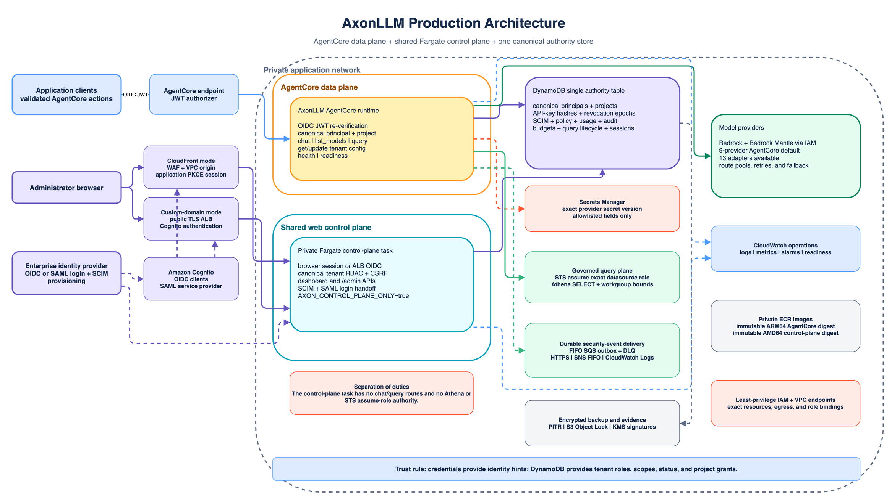
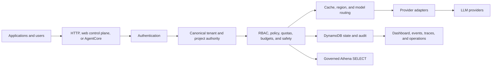
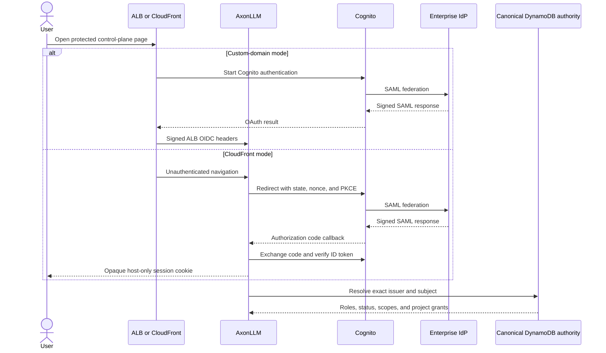
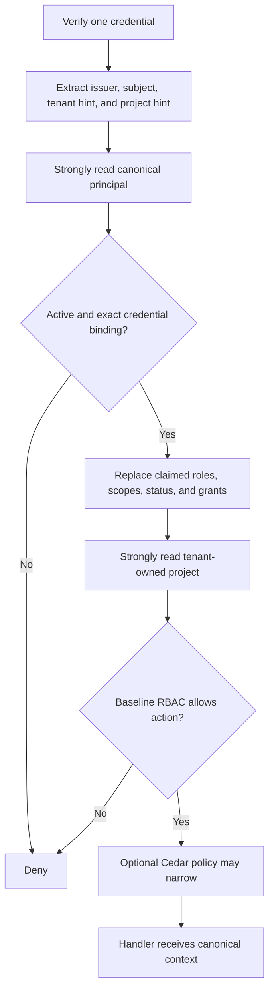
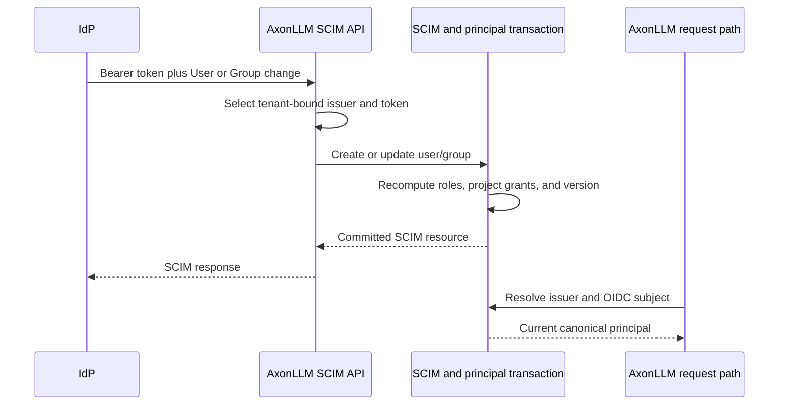
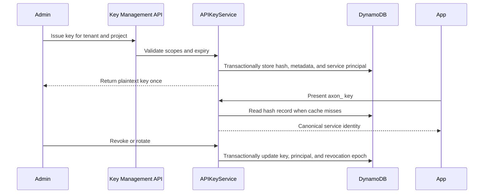
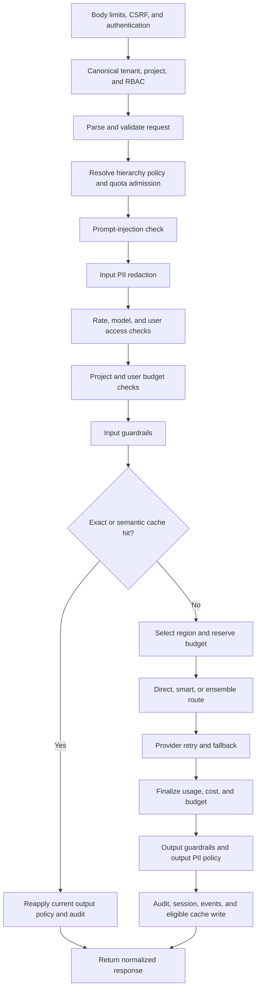
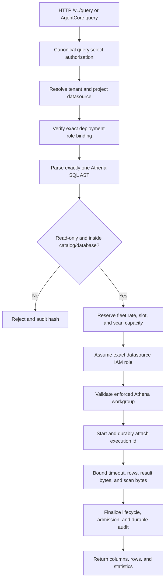
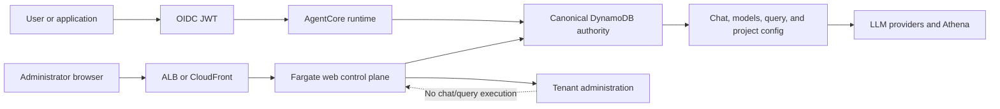

# AxonLLM In Simple English

This guide explains what AxonLLM does, how its main features work, and where
each flow is implemented. It describes the current repository behavior. It is
not a claim that a particular deployment has completed production
certification.

For detailed operational contracts, see
[Features And Flows](FEATURES_AND_FLOWS.md), the
[AgentCore Runbook](AGENTCORE_RUNBOOK.md), and the
[Production Runbook](PRODUCTION_RUNBOOK.md).

## 1. What AxonLLM Is

AxonLLM is a gateway between applications and large-language-model providers.
An application sends one normalized chat request to AxonLLM. AxonLLM decides
whether the caller is allowed, applies cost and safety controls, chooses a
model/provider route, translates the request, and returns a normalized
response.

Its main jobs are:

- give applications one native or OpenAI-compatible API;
- route requests across multiple models, providers, credentials, and regions;
- retry or fall back when a provider route fails;
- enforce tenant, project, user, model, quota, and budget rules;
- redact PII and apply request/response guardrails;
- record usage, cost, audit, traces, and security events;
- expose a read-only, governed Athena query path;
- provide a tenant-aware administration dashboard and APIs; and
- run either as a normal Starlette service or through Amazon Bedrock
  AgentCore.

AxonLLM is not an LLM, an identity provider, a SAML service provider, a general
SQL gateway, or a tool-execution engine.

Key implementation entry points:

- application assembly: [`bootstrap.py`](../src/gateway/bootstrap.py)
- chat orchestration: [`agent.py`](../src/gateway/agent.py)
- provider fallback: [`router.py`](../src/gateway/router.py)
- durable state: [`persistence.py`](../src/gateway/persistence.py)

## 2. Runtime Surfaces

| Surface | What it provides |
|---|---|
| Public site | Landing page, showcase, and interactive architecture assets |
| Starlette data plane | Native chat, OpenAI-compatible chat/model APIs, and optional governed query |
| Shared web control plane | Dashboard and tenant administration against the same canonical state as AgentCore |
| AgentCore runtime | Authenticated actions for chat, model listing, query, project configuration, health, and readiness |
| Local seeded demo | Fictional data and `LOG_ONLY` authentication for evaluation only |

Important HTTP routes are:

| Route | Purpose |
|---|---|
| `POST /api/chat` | Native non-streaming chat |
| `POST /api/chat/stream` | Native SSE chat |
| `GET /api/models` | Native model list |
| `POST /v1/chat/completions` | OpenAI-compatible chat and streaming |
| `GET /v1/models` | OpenAI-compatible model list |
| `POST /v1/query` | Optional governed Athena `SELECT` |
| `/admin/*` | Administration APIs and dashboard |
| `/scim/v2/*` | IdP-driven user and group provisioning |
| `/health` and `/ready` | Liveness and dependency readiness |

A process started with `AXON_CONTROL_PLANE_ONLY=true` exposes administration
but suppresses chat, model, and query execution. This keeps the shared web
control plane from becoming a second data plane.

## 3. Identity Terms Without The Jargon

These features solve different problems:

| Term | Simple meaning | AxonLLM behavior |
|---|---|---|
| Authentication | "Who presented this credential?" | Verifies a browser session, ALB OIDC header, OIDC JWT, or Axon API key |
| SSO | "Use the company login once" | Sends browser login through Cognito and the enterprise IdP |
| SAML | Federation protocol often used by enterprise IdPs | Terminates at Cognito, not AxonLLM |
| OAuth authorization code with PKCE | Safe browser login exchange | Used by the CloudFront control-plane mode |
| OIDC | Identity tokens built on OAuth | Used from Cognito or an external IdP to identify a user |
| SCIM | User/group provisioning protocol | Creates, changes, and deactivates canonical tenant principals |
| Authorization/RBAC | "What may this identity do?" | Uses server-held tenant roles, project grants, and service scopes |

Authentication and provisioning are deliberately separate. A valid corporate
login does not grant AxonLLM access until a matching active canonical principal
and project grant exist.

## 4. How Browser SSO Works

AxonLLM supports two managed-Cognito web-control-plane modes:

| Mode | Browser authentication |
|---|---|
| `custom-domain` | The public ALB runs Cognito authentication and sends signed `X-Amzn-Oidc-*` headers to AxonLLM |
| `cloudfront` | AxonLLM runs authorization code with S256 PKCE and creates an opaque DynamoDB-backed browser session |

An enterprise SAML login follows this trust path:

The security boundary is:

1. Cognito is the SAML service provider.
2. Cognito validates the SAML assertion and protocol state.
3. ALB or AxonLLM validates the resulting OIDC identity.
4. AxonLLM resolves the exact OIDC issuer and subject to server-held authority.

AxonLLM's `/saml/login` route is only a safe handoff to managed login.
`/saml/acs` and `/saml/metadata` return `410` because direct SAML processing is
disabled.

The CDK identity stack creates the Cognito pool and clients, but it does not
create a tenant's enterprise SAML IdP configuration. An operator must add the
IdP metadata/certificate to Cognito, enable it on the appropriate app client,
and provision matching Cognito subjects into canonical authority.

CloudFront browser sessions add these controls:

- one-time state, nonce, and PKCE verifier material;
- opaque cookies whose SHA-256 keys, not plaintext cookies, are stored;
- strong session reads, absolute expiry, and compare-and-swap refresh;
- Secure, HttpOnly, SameSite cookies;
- double-submit CSRF checks on cookie-authenticated writes; and
- explicit logout that removes the server-held session.

Relevant code:

- [`oidc_service.py`](../src/gateway/auth/oidc_service.py)
- [`browser_session.py`](../src/gateway/auth/browser_session.py)
- [`saml_service.py`](../src/gateway/auth/saml_service.py)
- [`saml_routes.py`](../src/gateway/auth/saml_routes.py)
- [`identity_stack.py`](../src/gateway/deployment/infra/identity_stack.py)

## 5. Authentication Order

The normal Starlette service accepts exactly one credential family:

1. CloudFront application browser-session cookie.
2. ALB OIDC headers.
3. `Authorization: Bearer ...`; an `axon_` prefix means Axon API key,
   otherwise it is treated as an OIDC JWT.
4. `X-Api-Key`.

Conflicting credential families are rejected. Malformed higher-priority
credentials do not fall through to another credential supplied beside them.
Under `AXON_AUTH_MODE=ENFORCE`, a protected request without a valid credential
is rejected.

The middleware is implemented in
[`middleware/auth.py`](../src/gateway/middleware/auth.py).

## 6. Canonical Multitenancy

In production, token claims identify where to look; they do not decide what a
caller may do.

The important rules are:

- a principal belongs to one canonical tenant;
- project access is an explicit server-held grant;
- OIDC roles, groups, scopes, tenant, and project values are not merged into
  canonical authority;
- API keys resolve to server-held `service` principals;
- a project is strongly read under its tenant-qualified DynamoDB key;
- an unauthorized or cross-tenant resource is normally concealed as `404`;
- an unavailable authority store returns `503` rather than guessing; and
- Cedar policy can restrict an RBAC allow, but cannot turn an RBAC denial into
  an allow.

Tenant-qualified data includes projects, principals, SCIM records, API keys,
policy state, usage, budgets, audit, event destinations, query datasources, and
query lifecycle records.

Relevant code:

- [`principal.py`](../src/gateway/auth/principal.py)
- [`dynamo_principal_repository.py`](../src/gateway/auth/dynamo_principal_repository.py)
- [`project_repository.py`](../src/gateway/auth/project_repository.py)
- [`tenant_authorization.py`](../src/gateway/middleware/tenant_authorization.py)
- [`authorization.py`](../src/gateway/auth/authorization.py)

## 7. RBAC In Plain English

| Role | Tenant configuration | Project data plane |
|---|---|---|
| `tenant_admin` | Read and write tenant-owned settings | Requires an explicit project grant for model list, chat, and query |
| `tenant_member` | Read only | Requires an explicit project grant |
| `tenant_auditor` | Read only; currently the same baseline actions as member | Requires an explicit project grant |
| `service` | No admin/control-plane access | Requires a project grant and an action scope |
| `platform_admin` | Platform resources; tenant entry requires audited break glass | No ordinary tenant project path |

The service scopes used by the data plane are:

- `model.list`
- `inference.invoke`
- `query.select`

`query.mutate` always denies. There is no SQL write feature.

Canonical roles take precedence over old migration scopes. A viewer does not
become an administrator by presenting `admin:*`, and canonical key issuance
rejects legacy `admin:` scopes.

## 8. SCIM Provisioning

SSO authenticates a person. SCIM decides whether that person exists in the
tenant and what canonical membership they hold.

Canonical deployments configure a different `{issuer, token}` credential for
each tenant through `AXON_SCIM_TENANTS`. No SCIM credential means provisioning
is disabled with `503`; a wrong token returns `401`.

Implemented behavior includes:

- `/scim/v2/Users` and `/scim/v2/Groups`;
- list, create, read, replace, delete, and user activation PATCH;
- user roles plus roles inherited from group membership;
- default `tenant_member` when no role is supplied;
- prohibition on assigning `platform_admin` or `service` through SCIM;
- immutable issuer and subject binding;
- `externalId` equal to the OIDC subject; and
- deprovisioning that makes the canonical principal inactive.

SCIM writes update the canonical principal and authorization versions, so the
next request is evaluated against the new authority.

Relevant code:

- [`scim_routes.py`](../src/gateway/auth/scim_routes.py)
- [`scim_service.py`](../src/gateway/auth/scim_service.py)

## 9. The Different Credentials

Several values are called "keys" or "tokens", but they have different jobs:

| Credential | Who uses it | What it authorizes |
|---|---|---|
| OIDC JWT | Human, service, or AgentCore client | Identity that must resolve to a canonical principal |
| Browser session cookie | Signed-in control-plane browser | A server-held Cognito-derived session |
| Axon API key (`axon_...`) | Application calling normal HTTP APIs | One canonical service principal, tenant, project grant, and scopes |
| Provider API key | AxonLLM itself | Calls to a provider such as OpenAI, Anthropic, or Google AI Studio |
| SCIM bearer token | Enterprise IdP provisioning client | Changes to one tenant's SCIM users and groups |
| AWS role credentials | AxonLLM runtime | Bedrock, Mantle, DynamoDB, Athena role assumption, and other AWS services |

AgentCore accepts OIDC JWT identity at its invocation boundary. It does not
accept Axon API keys.

### Axon API-Key Lifecycle

Only the SHA-256 hash is persisted. The plaintext key is returned once at issue
or rotation time. Canonical tenant keys:

- default to 90 days;
- cannot exceed 365 days;
- belong to one tenant and one project grant;
- authenticate as `service`;
- may receive only supported server-held data-plane scopes; and
- are issued, revoked, and rotated with DynamoDB transactions.

Validation uses a five-minute local cache. Each instance polls a tenant
revocation epoch about every five seconds; if that read fails, behavior degrades
to the cache TTL.

Tenant members and auditors may inspect key metadata. Only `tenant_admin` may
issue, rotate, or revoke tenant keys.

Relevant code:

- [`api_key_service.py`](../src/gateway/auth/api_key_service.py)
- [`key_routes.py`](../src/gateway/admin/key_routes.py)

### Provider Credentials

Provider credentials are deployment credentials, not Axon client identities.

For local development, provider configuration comes from
`config/providers.yaml` or environment variables, with environment variables
taking precedence. In production AgentCore deployments, allowlisted fields are
read from the exact Secrets Manager secret/version named by
`AXON_PROVIDER_SECRET_ARN` and `AXON_PROVIDER_SECRET_VERSION`.

Bedrock and Bedrock Mantle use the runtime's AWS role rather than a stored
provider API key. An HTTP provider is available only when its required
credential and endpoint configuration load successfully. Multiple route
entries can represent separate keys/endpoints with independent weights,
priorities, capacities, and health.

The tenant admin API does not reveal or manage provider secret values. Secret
rotation and provider enablement remain deployment operations.

Relevant code:

- [`provider_loader.py`](../src/gateway/provider_loader.py)
- [`provider_routes.py`](../src/gateway/provider_routes.py)
- [`multi_provider_factory.py`](../src/gateway/multi_provider_factory.py)

## 10. Chat Request Flow

The normal non-streaming path is:

The ordering matters:

- invalid or unauthorized requests are rejected before a provider call;
- budget is reserved before dispatch when an applicable limit exists;
- a normal provider charge is accounted before output policy can withhold the
  response;
- cache hits re-run current output policy and audit rather than bypassing them;
  and
- only a post-policy, non-streaming response is eligible for a cache write.

Prompt-injection and PII security events are emitted at the stage where they
are detected. Usage traces are emitted after accounting. Audit failure can
still fail a protected response closed without removing a provider charge that
already occurred.

### Streaming

Streaming has extra rules:

- without output guardrails or output PII inspection, supported providers can
  relay chunks as they arrive;
- with output policy enabled, AxonLLM buffers a bounded complete response,
  evaluates it, and only then releases approved content;
- fallback is possible while opening a stream, but not after provider content
  has started;
- accounting and audit finalize on success, error, cancellation, or client
  abandonment;
- providers without the native streaming path may return a complete response
  that AxonLLM emits as simulated chunks; and
- ensemble panel answers are never streamed; only the final judge or approved
  best-single result is emitted.

## 11. Routing And Providers

The code contains 13 adapters:

- Bedrock
- Bedrock Mantle
- Anthropic
- OpenAI
- Google AI Studio
- xAI
- Groq
- Together
- Fireworks
- direct AI21
- Azure OpenAI
- Cohere
- Vertex AI

AgentCore defaults to the first nine. Direct AI21, Azure OpenAI, Cohere, and
Vertex AI are opt-in. AI21 models can also be reached through the default
Bedrock provider when configured there.

AxonLLM separates a logical model name from a concrete provider model. One
logical model can have several provider mappings ordered for fallback.

Routing options are:

| Mode | What it does |
|---|---|
| Round robin | Rotates through healthy mappings |
| Weighted | Distributes traffic by configured weight |
| Least latency | Prefers the healthiest low-latency mapping |
| Cost optimized | Prefers the priced lower-cost mapping |
| Smart | Classifies the prompt and scores allowed model candidates for quality and cost |
| Ensemble | Calls a panel in parallel and combines the surviving answers |

For a normal route, the router selects an initial healthy mapping, retries
retryable failures with bounded backoff, and then walks the remaining fallback
chain. Route pools add per-credential health, concurrency, capacity, priority,
and recovery probes.

An ensemble:

1. validates access to every panel and judge model;
2. checks its estimated cost ceiling;
3. calls panel models in parallel;
4. records survivors and per-call cost;
5. checks quorum;
6. either fails, returns the ranked best survivor, or asks the judge to
   synthesize the final response.

Multi-region routing can run single-region, active-passive, or active-active.
Data-residency filters remove spokes outside the requested zone before provider
selection.

Relevant code:

- [`router.py`](../src/gateway/router.py)
- [`smart_routing.py`](../src/gateway/smart_routing.py)
- [`ensemble.py`](../src/gateway/ensemble.py)
- [`ensemble_config.py`](../src/gateway/ensemble_config.py)
- [`multi_region`](../src/gateway/multi_region)
- [`adapters`](../src/gateway/adapters)

## 12. Tool Calling

Callers define tools in OpenAI's `tools` and `tool_choice` shape. Supported
provider/model routes translate those definitions into their native dialect
and translate model calls back into normalized `tool_calls`.

AxonLLM does not execute a model-requested tool. The calling application must:

1. receive the tool call;
2. execute the named function in its own trusted environment;
3. send the tool result back in a later chat request; and
4. preserve the opaque tool-call ID.

The governed query API is separate. Naming a tool `db_query` does not cause
AxonLLM to run `/v1/query`.

Tool translation lives in the provider adapters and
[`provider_config.py`](../src/gateway/provider_config.py).

## 13. Governance, Quotas, And Budgets

The policy hierarchy is `organization -> business unit -> project ->
environment`. Children may tighten inherited controls:

| Setting | Merge rule |
|---|---|
| Rate limit | Lowest value wins |
| Budget | Lowest value wins |
| Maximum tokens | Lowest value wins |
| Allowed models | Intersection |
| Allowed providers | Intersection |
| PII enabled | Once enabled, remains enabled |
| PII types | Union of the stricter types |

The request path combines:

- hierarchy-derived project RPM and policy checks;
- project and user model restrictions;
- project and user spend checks;
- durable budget reservations before provider dispatch;
- reconciliation from estimate to actual cost afterward; and
- threshold events as configured spend levels are crossed.

DynamoDB-backed admission makes rate and budget decisions fleet-wide rather
than per process. Compare-and-swap revisions protect configuration updates from
lost writes.

Optional Cedar policy is a second restriction layer. It can deny an operation
that RBAC allowed, but cannot expand baseline RBAC.

Relevant code:

- [`policy_hierarchy.py`](../src/gateway/auth/policy_hierarchy.py)
- [`quota_enforcer.py`](../src/gateway/quota_enforcer.py)
- [`cost_tracker.py`](../src/gateway/cost_tracker.py)
- [`cedar_policy.py`](../src/gateway/auth/cedar_policy.py)

## 14. Safety Controls

### Prompt Injection

The detector scores patterns such as role override, system-prompt extraction,
delimiter escape, and encoded payloads. A high-enough score blocks the request;
lower findings can still be audited and dispatched as security events.

### PII

Pattern matching supports shaped values such as email, SSN, credit card, phone,
IPv4/IPv6, AWS account id, medical record, IBAN, and passport. Optional Amazon
Comprehend detection adds names, addresses, and ages.

Input and output failure behavior is intentionally different:

- during input redaction, a Comprehend failure records the detector error and
  continues with regex redaction;
- during configured output inspection, a detector failure withholds or fails
  the response because uninspected provider output must not be released.

On output, AxonLLM may restore values that came from the caller when
re-injection is enabled. Newly generated PII remains redacted rather than being
treated as caller-owned data. Tool arguments are also inspected.

### Guardrails

Project guardrails inspect requests before provider dispatch and inspect
responses afterward. Response checks include textual content and serialized
tool/function calls. Blocking output can replace or withhold content, but it
does not erase provider usage already incurred.

Relevant code:

- [`injection_detector.py`](../src/gateway/security/injection_detector.py)
- [`pii_redactor.py`](../src/gateway/security/pii_redactor.py)
- [`guardrail_engine.py`](../src/gateway/guardrail_engine.py)

## 15. Caching And Efficiency

The exact cache hashes the normalized request and namespaces it by tenant and
project. The semantic cache uses embeddings to match a reworded question after
the exact cache misses.

Semantic matches add safeguards:

- a configured similarity threshold;
- exact agreement on numbers, dates, quoted strings, and code-like literals;
- rejection of conflicting polar concepts such as enable/disable; and
- exclusion of requests with streaming, tools, or nondeterministic
  temperature.

Chat caching also excludes requests containing redacted PII, provider/region
overrides, smart routing, and ensembles. Cache hits reapply current response
guardrails and PII policy.

The response caches and provider-health state are process-local. They are not a
distributed cross-replica cache. Semantic embeddings require the configured
embedding dependency.

Efficiency analytics report token waste, prompt complexity, model
right-sizing, output utilization, and historical patterns. They recommend
changes; they do not silently rewrite prompts.

Relevant code:

- [`cache_manager.py`](../src/gateway/cache_manager.py)
- [`semantic_cache.py`](../src/gateway/semantic_cache.py)
- [`semantic_efficiency.py`](../src/gateway/semantic_efficiency.py)

## 16. Audit, Usage, Traces, And Events

These mechanisms are related but distinct:

| Mechanism | Purpose |
|---|---|
| Usage/cost record | Token, provider, model, latency, user, project, and calculated charge |
| Audit trail | Tenant-qualified append-only records linked by a SHA-256 hash chain |
| Trace export | Best-effort external or OTLP observability for completed usage |
| Security event | Injection, PII, budget, or authentication signal sent to configured destinations |
| Query lifecycle | Durable accepted/running/terminal execution and recovery state |

Production event delivery can enqueue a tenant-qualified destination snapshot
to a FIFO SQS outbox. A worker sends to approved HTTPS, SNS FIFO, or CloudWatch
Logs destinations. Retries are bounded and a DLQ retains repeated failures.
Delivery is at least once, so receivers must be idempotent.

The dashboard exposes usage, spend, traces, audit, efficiency, projects, users,
keys, policies, quotas, regions, webhooks, health, configuration, architecture,
pricing, catalogue drift, readiness, and the sandbox.

Relevant code:

- [`audit_trail.py`](../src/gateway/security/audit_trail.py)
- [`event_dispatcher.py`](../src/gateway/security/event_dispatcher.py)
- [`webhook_routes.py`](../src/gateway/admin/webhook_routes.py)
- [`admin/routes.py`](../src/gateway/admin/routes.py)

## 17. Governed Athena SELECT

AxonLLM exposes a narrow read path, not arbitrary database access.

The SQL policy accepts one parsed Athena read query. It rejects:

- multiple statements;
- DDL, DML, and commands;
- `SELECT INTO`;
- table functions; and
- catalog/database references outside the datasource.

Each datasource stores metadata only: tenant, project, role ARN, region,
catalog, database, workgroup, enabled state, and revision. It stores no AWS
access key, database password, or connection string.

Admission bounds project/principal RPM, concurrency, and aggregate scan
reservations. Lifecycle state is durable. A fenced reconciler can close
interrupted work, cancel or observe Athena execution, release reservations,
and replay pending terminal audit. Audit records store an SQL hash, not the SQL
literal.

The shared web control plane can administer datasource metadata but has no
Athena or STS assume-role permission. Actual execution stays in the data plane.

Relevant code:

- [`query/routes.py`](../src/gateway/query/routes.py)
- [`query/service.py`](../src/gateway/query/service.py)
- [`query/sql_policy.py`](../src/gateway/query/sql_policy.py)
- [`query/athena.py`](../src/gateway/query/athena.py)
- [`query/reconciliation.py`](../src/gateway/query/reconciliation.py)
- [`datasource_routes.py`](../src/gateway/admin/datasource_routes.py)

## 18. AgentCore And The Shared Control Plane

AgentCore accepts these invocation actions:

| Action | Behavior |
|---|---|
| `chat` | Run the governed chat pipeline |
| `list_models` | Return models allowed for the canonical project |
| `query` | Run the shared governed query service when enabled |
| `get_tenant_config` | Read selected project runtime configuration |
| `update_tenant_config` | `tenant_admin` compare-and-swap update of allowlisted runtime fields |
| `health` | Sanitized liveness |
| `readiness` | Sanitized dependency readiness |

AgentCore re-verifies the OIDC JWT, rejects tenant/role/scope fields supplied in
the payload, resolves canonical identity and project, applies baseline RBAC and
optional Cedar, and then invokes the shared gateway services.

The configuration actions do not manage membership, API keys, policies,
datasources, webhooks, provider secrets, or event destinations. Those broader
operations remain on the shared web control plane.

The managed first-adopter choices are:

| Identity mode | Result |
|---|---|
| `managed-cognito` | Retained Cognito, canonical bootstrap, AgentCore, and shared web control plane |
| `external-oidc` | AgentCore and canonical bootstrap using the adopter's exact issuer/client/audience; no managed Cognito web control plane |

Managed Cognito can use either a customer custom domain with ALB Cognito or a
generated CloudFront hostname with application PKCE sessions. The generated
CloudFront path removes the need for the adopter to own a public domain for the
control plane.

The AgentCore runtime image is separate from the Fargate control-plane image,
but both use the same canonical state table. The control plane imports the
AgentCore table and related event/audit resources; it does not create a second
authority store.

Relevant code:

- [`agentcore/adapter.py`](../src/gateway/agentcore/adapter.py)
- [`agentcore/identity.py`](../src/gateway/agentcore/identity.py)
- [`agentcore/runtime.py`](../src/gateway/agentcore/runtime.py)
- [`agentcore/schemas.py`](../src/gateway/agentcore/schemas.py)
- [`agentcore_stack.py`](../src/gateway/deployment/infra/agentcore_stack.py)
- [`control_plane_stack.py`](../src/gateway/deployment/infra/control_plane_stack.py)

## 19. Deployment Modes And Safety Boundaries

| Mode | Appropriate use |
|---|---|
| Local seeded `LOG_ONLY` | Demo and development on a trusted machine |
| Starlette/Fargate with canonical identity | Full HTTP data and control plane |
| AgentCore plus shared Fargate control plane | AgentCore data plane with browser administration |
| External OIDC AgentCore | AgentCore data plane using an existing enterprise OIDC provider |

The production profile refuses startup unless authentication is enforced,
DynamoDB is enabled, and canonical identity is required. Local in-memory and
`LOG_ONLY` paths are compatibility/development behavior, not isolation between
untrusted tenants.

The repository also contains private-network CDK, immutable image inputs,
backups, alarms, release signing/evidence, qualification, recovery, and
promotion workflows. Those controls support a production launch process; their
presence does not prove that a particular AWS account has passed canaries,
restore exercises, load validation, alarm delivery, or operational approval.

## 20. Important Boundaries And Current Limitations

- AxonLLM does not validate SAML assertions; Cognito does.
- The deployment does not automatically create a tenant enterprise SAML IdP in
  Cognito.
- OIDC claims are not final roles or scopes in canonical mode.
- AgentCore accepts OIDC JWTs, not Axon API keys.
- Tenant viewers cannot update tenant configuration.
- Tenant administrators still need an explicit grant for project data-plane
  actions.
- Service keys cannot use the canonical admin control plane.
- `query.select` is implemented; SQL writes are not.
- Model-requested tools are returned to the caller and are not executed by
  AxonLLM.
- Exact and semantic response caches are process-local.
- Provider credentials are deployment secrets, not tenant-managed credentials.
- The local anonymous seeded demo is not production-safe.
- Repository implementation and release evidence are not the same as a
  completed production certification.

## 21. Code Map

| Area | Primary files |
|---|---|
| Application assembly | [`bootstrap.py`](../src/gateway/bootstrap.py), [`config.py`](../src/gateway/config.py) |
| HTTP authentication | [`middleware/auth.py`](../src/gateway/middleware/auth.py), [`oidc_service.py`](../src/gateway/auth/oidc_service.py) |
| Browser SSO | [`browser_session.py`](../src/gateway/auth/browser_session.py), [`saml_routes.py`](../src/gateway/auth/saml_routes.py) |
| Canonical identity | [`principal.py`](../src/gateway/auth/principal.py), [`dynamo_principal_repository.py`](../src/gateway/auth/dynamo_principal_repository.py) |
| RBAC | [`authorization.py`](../src/gateway/auth/authorization.py), [`admin_rbac.py`](../src/gateway/middleware/admin_rbac.py) |
| SCIM | [`scim_routes.py`](../src/gateway/auth/scim_routes.py), [`scim_service.py`](../src/gateway/auth/scim_service.py) |
| API keys | [`api_key_service.py`](../src/gateway/auth/api_key_service.py), [`key_routes.py`](../src/gateway/admin/key_routes.py) |
| Chat pipeline | [`agent.py`](../src/gateway/agent.py), [`chat/routes.py`](../src/gateway/chat/routes.py), [`openai_routes.py`](../src/gateway/chat/openai_routes.py) |
| Routing | [`router.py`](../src/gateway/router.py), [`smart_routing.py`](../src/gateway/smart_routing.py), [`ensemble.py`](../src/gateway/ensemble.py) |
| Providers | [`provider_loader.py`](../src/gateway/provider_loader.py), [`adapters`](../src/gateway/adapters) |
| Governance | [`policy_hierarchy.py`](../src/gateway/auth/policy_hierarchy.py), [`quota_enforcer.py`](../src/gateway/quota_enforcer.py), [`cost_tracker.py`](../src/gateway/cost_tracker.py) |
| Safety | [`security`](../src/gateway/security), [`guardrail_engine.py`](../src/gateway/guardrail_engine.py) |
| Cache and efficiency | [`cache_manager.py`](../src/gateway/cache_manager.py), [`semantic_cache.py`](../src/gateway/semantic_cache.py), [`semantic_efficiency.py`](../src/gateway/semantic_efficiency.py) |
| Query | [`query`](../src/gateway/query), [`datasource_routes.py`](../src/gateway/admin/datasource_routes.py) |
| Admin control plane | [`admin`](../src/gateway/admin), [`control_plane_stack.py`](../src/gateway/deployment/infra/control_plane_stack.py) |
| AgentCore | [`agentcore`](../src/gateway/agentcore), [`agentcore_stack.py`](../src/gateway/deployment/infra/agentcore_stack.py) |
| Persistence | [`persistence.py`](../src/gateway/persistence.py) |
