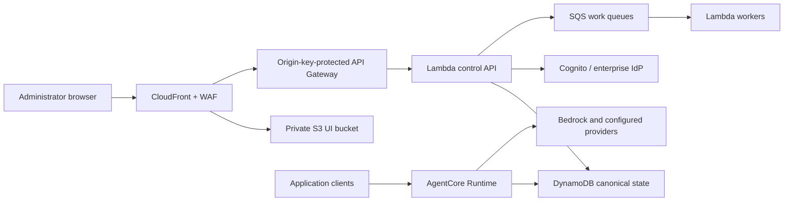

# AxonLLM Deployment Architecture Plan

- Status: Accepted
- Date: 2026-08-16
- Scope: Embedded, standalone, and Amazon Bedrock AgentCore delivery modes
- Related decision: [ADR 0001: AxonLLM v0.3 Product Boundary](adr/0001-v0.3-product-boundary.md)
- Deployment decision: [ADR 0002: Deployment Architecture](adr/0002-deployment-architecture.md)

> This document describes the target deployment architecture. The existing
> production and AgentCore runbooks remain authoritative until each migration
> phase has passed its acceptance gates.

## 1. Executive Decision

AxonLLM will have one infrastructure-neutral routing core and three hosting
models:

| Mode | Shape | Intended use |
|---|---|---|
| Ostiari embedded | Router library and control contract inside Ostiari | Ostiari applications that need AxonLLM routing without another service |
| Standalone | One deployable image containing the router, control API, and UI | Local use, Docker, customer-managed ECS, and simpler self-hosting |
| AgentCore | Router in AgentCore plus a serverless web control plane | Recommended managed AWS deployment |

The AgentCore web control plane will use this target shape:



The target AgentCore control plane has:

- no UI Fargate service;
- no UI Application Load Balancer;
- no UI VPC;
- no UI NAT gateways; and
- no customer port-forwarding requirement.

CloudFront is the documented customer endpoint. Every API Gateway method
requires a generated origin credential that CloudFront adds only to origin
requests. Direct API Gateway requests without that credential fail before
Lambda. The existing Cognito PKCE, opaque browser session, canonical tenant
authorization, SCIM bearer authorization, and CSRF controls remain the real
application authorization boundary.

## 2. Why We Chose This Plan

### 2.1 The current AWS topology is heavier than the product requires

The current [AgentCore stack](../src/gateway/deployment/infra/agentcore_stack.py)
creates a dedicated VPC and two NAT gateways. The current
[control-plane stack](../src/gateway/deployment/infra/control_plane_stack.py)
creates another VPC, two more NAT gateways, an ALB, and two Fargate tasks.

That topology is defensible as an isolated reference deployment, but it makes
four assumptions that should not be imposed on every adopter:

1. The adopter has no usable VPC.
2. AxonLLM must own internet egress.
3. A mostly static browser interface needs an always-running container service.
4. The AgentCore runtime and web control plane need different networks.

Many enterprise adopters already have approved subnets, centralized egress,
DNS, inspection, and identity. Creating parallel infrastructure increases
cost, security review effort, IP address consumption, and operational
ownership.

### 2.2 AxonLLM has three genuinely different hosting needs

A universal deployment would optimize one mode at the expense of the others:

- Ostiari needs a lightweight in-process router, not AWS infrastructure.
- A small self-hosted user benefits from a single image with the UI included.
- AgentCore already supplies the managed data-plane runtime, so duplicating a
  conventional web platform around it adds little value.

The shared unit should therefore be the router and its contracts, not one
universal container topology.

### 2.3 The UI is not the inference data plane

The browser dashboard is primarily static HTML, JavaScript, and CSS under
[admin/static](../src/gateway/admin/static). Its dynamic operations are
administrative requests against canonical state.

Keeping the UI and control API off the AgentCore inference path provides:

- independent scaling;
- smaller runtime permissions;
- safer control-plane deployments;
- no UI failure impact on inference; and
- no synchronous control-plane dependency for configured router requests.

Routers continue using signed, versioned configuration snapshots and the
last-known-good snapshot during a control-plane outage.

### 2.4 Port forwarding is not a product access model

VPN routes and SSM/SSH port forwarding are useful for operator diagnostics.
They are not acceptable as the normal way for a customer to open AxonLLM.

Every supported deployment must provide one of these access models:

| Access model | Customer experience |
|---|---|
| Public authenticated | Open a normal CloudFront HTTPS URL and authenticate |
| Corporate restricted | Connect to the customer's normal corporate VPN, then open the same HTTPS URL allowed by WAF policy |
| Strict private | Use customer-managed private ingress such as an internal ALB or verified private-access product |
| Diagnostics | Operator-only tunnel; never documented as the user workflow |

The standard AgentCore mode is public authenticated. A corporate deployment
may restrict CloudFront at WAF to approved enterprise egress addresses. A
strict-private deployment is optional and uses customer-owned networking; it
does not cause AxonLLM to silently create a second VPC.

The standard WAF policy uses managed protections and rate limits. A viewer IP
allowlist is an optional corporate restriction, not a universal requirement.

### 2.5 Runtime lifecycle must be separate from durable state

AgentCore Runtime does not have a pause operation. Removing a runtime from the
current combined stack also touches its VPC, endpoints, IAM, alarms, and
resources that share the same CloudFormation dependency graph with durable
state.

That makes a routine cost-control operation harder than it should be. The
target architecture therefore separates:

- retained application state and identity;
- optional managed networking;
- disposable AgentCore runtime resources; and
- the request-driven web control plane.

An adopter can then park the runtime and managed network without deleting
configuration, audit history, identities, backups, release evidence, or the
on-demand administration surface.

## 3. Design Principles

1. **One router core.** Routing, provider translation, retry, fallback,
   streaming, and usage accounting have one implementation.
2. **Host infrastructure is an adapter.** AgentCore, Starlette, Docker, and
   Ostiari are delivery adapters around the router.
3. **Infrastructure ownership is explicit.** AxonLLM never silently creates a
   VPC, NAT gateway, route table, or public endpoint.
4. **The control plane is off the hot path.** Inference uses a locally available
   signed snapshot.
5. **State has one canonical authority.** DynamoDB remains the shared AWS
   authority; PostgreSQL and Redis are not added without a demonstrated need.
6. **Customer access uses normal HTTPS.** Tunnels are for diagnostics only.
7. **Stateful resources move last.** Refactoring must not replace retained
   tables, keys, queues, buckets, identities, or backups.
8. **Managed convenience is optional.** AxonLLM can create infrastructure for a
   new adopter, but production guidance prefers existing platform resources.

## 4. Deployment Modes

### 4.1 Ostiari embedded mode

Ostiari imports AxonLLM as a library:

```text
Ostiari request
    -> Ostiari identity and governance
    -> embedded AxonLLM control contract
    -> AxonLLM routing core
    -> selected model provider
```

AxonLLM creates no VPC, container, load balancer, database, or AWS stack in
this mode. The mandatory AxonLLM control-plane capabilities are hosted inside
Ostiari rather than omitted: Ostiari supplies the user experience and durable
host services, while AxonLLM supplies routing configuration validation,
publication, and policy contracts.

Ostiari supplies narrow explicit host interfaces:

- `RoutingConfigurationProvider`
- `CredentialResolver`
- request-scoped `IdentityContext`
- `TelemetrySink`
- `UsageSink`
- router lifecycle start and close

Ostiari owns application governance, risk scoring, workflow policy, and its
browser experience. AxonLLM owns provider selection, translation, retry,
fallback, token accounting, and cost accounting.

Trace forwarding now receives constructor-injected sinks, and standalone
environment translation remains in the standalone bootstrap adapter. No
Ostiari import is required by the AxonLLM package.

Package dependencies should be separated into extras:

| Package surface | Dependencies |
|---|---|
| `axonllm` | Routing core, host protocols, and provider-neutral contracts |
| `axonllm[bedrock]` | AWS SDK and Bedrock adapter |
| `axonllm[server]` | Starlette/Uvicorn standalone server |
| `axonllm[agentcore]` | AgentCore runtime adapter |
| `axonllm[aws-control]` | AWS control-plane persistence and identity |

This prevents embedded Ostiari users from installing a web server or AWS
control-plane dependencies they do not use.

[ADR 0002](adr/0002-deployment-architecture.md) accepts the Ostiari embedding
direction. `DP-003` provides the infrastructure-neutral host protocols and
construction seams. The AxonLLM side of `DP-010` is implemented by
`OstiariRouterAdapter`; the separate Ostiari gateway consumer migration is
documented in the
[Ostiari Embedded Adapter guide](OSTIARI_EMBEDDED_ADAPTER.md) and remains
pending until its existing lifecycle/server changes are reconciled.

### 4.2 Standalone mode

Standalone keeps the simple product experience:

```text
One AxonLLM image
    - OpenAI-compatible and native APIs
    - routing core
    - control API
    - web UI
```

This copies the useful part of a single-container gateway design: easy local
and self-hosted installation. It does not require every AxonLLM deployment to
use that topology.

The same image may run as one instance for evaluation or as multiple replicas
behind customer-managed ingress. Production replicas must use shared durable
state; container-local state is an evaluation option, not a high-availability
design.

The standalone image is portable and does not assume AWS. Platform recipes may
be provided for Docker Compose, ECS/Fargate, and other container schedulers.
An optional AWS recipe must accept existing VPC and ingress resources. It must
not create networking unless the adopter selects managed networking
explicitly.

### 4.3 AgentCore mode

AgentCore hosts only the routing data plane:

- ARM64 runtime image;
- HTTP runtime adapter;
- JWT authorizer;
- signed configuration snapshot reader;
- least-privilege provider and state access; and
- no admin UI or browser-session server.

The web control plane is deployed separately using CloudFront, private S3, and
Lambda. The router and control plane share canonical state and signed
configuration contracts, not a process or load balancer.

The AgentCore runtime is disposable. Deleting and recreating it must not
replace the state table, signing keys, provider secret, queues, identity, UI
hostname, or audit history.

## 5. AgentCore Target Components

| Component | Responsibility | VPC required? |
|---|---|---|
| AgentCore Runtime | High-volume inference routing | Customer choice |
| CloudFront + WAF | Customer HTTPS entry point and edge policy | No |
| Private S3 bucket | Static dashboard assets | No |
| API Gateway + Lambda control API | Admin, auth callback, SCIM, configuration, budgets, audit | No by default |
| SQS queues and DLQs | Durable asynchronous work | No |
| Lambda workers | Security-event delivery, exports, reconciliation | No by default |
| EventBridge Scheduler | Periodic reconciliation and maintenance | No |
| DynamoDB | Canonical identity, configuration, sessions, usage, budgets, audit | No |
| Cognito / enterprise IdP | Browser and enterprise identity | No |
| KMS and Secrets Manager | Encryption, signing, and provider credentials | No |
| CloudWatch | Logs, metrics, alarms, and dashboards | No |

### 5.1 UI and control API

CloudFront uses separate path behaviors:

```text
/                         -> private S3 static UI
/app/* and /assets/*      -> private S3 static assets
/api/control/*            -> API Gateway -> Lambda control API
/auth/*                   -> API Gateway -> Lambda control API
/scim/*                   -> API Gateway -> Lambda control API
/exports/*                -> API Gateway -> Lambda or signed S3 download
```

Phase 3 separates static page routes from JSON administration routes. Existing
`/admin/*` URLs receive redirects or compatibility aliases during migration so
bookmarks and automation do not fail abruptly.

The initial Lambda should be a deliberately bounded control-API application,
not a function per existing route. This reduces migration risk while the
current Starlette handlers are separated from the full gateway assembly.
Functions may be split later when independent scaling, permissions, or
failure isolation justify it.

The first target uses Regional API Gateway rather than a Lambda Function URL.
CloudFront OAC for Lambda URLs requires clients sending `PUT`, `POST`, or
`PATCH` to provide `x-amz-content-sha256`. AxonLLM can modify its dashboard,
but it cannot require Cognito, SAML identity providers, or SCIM provisioning
clients to add that AWS-specific header. API Gateway accepts their standard
HTTP requests unchanged.

Every API method requires an origin API key generated in Secrets Manager.
CloudFront removes any viewer-supplied `x-api-key` and adds the origin value.
The API key is defense in depth for the origin, not user authorization.
Cognito sessions, CSRF, canonical RBAC, SAML, and SCIM bearer tokens retain
their existing responsibilities.

Both serverless artifacts are content-addressed and bound to the reviewed
source commit. The Lambda code uses an exact S3 object version. Static
deployment uses a dedicated least-privilege custom resource that downloads an
exact object version, verifies its SHA-256, rejects unsafe ZIP entries, prunes
stale destination objects, and invalidates the exact CloudFront distribution.
Resolving the latest version of a key is forbidden.

The Lambda must not construct the inference router or start persistent
background loops. The current assembly in
[bootstrap.py](../src/gateway/bootstrap.py) should become:

1. `build_router()`
2. `build_control_api()`
3. `build_worker()`

### 5.2 Work that must leave the web request

The current web process owns work that does not fit a request-driven Lambda:

- security-event outbox delivery;
- periodic health and topology reconciliation;
- query reconciliation;
- potentially large CSV exports; and
- long-running administrative jobs.

These become:

| Work | Target |
|---|---|
| Durable event delivery | SQS-triggered Lambda with partial batch failure and DLQ |
| Periodic reconciliation | EventBridge Scheduler to idempotent Lambda |
| Large exports | Asynchronous job, S3 object, and short-lived download URL |
| Multi-step administrative operation | Step Functions only when sequencing and rollback require it |

Small JSON administration requests remain synchronous.

### 5.3 When an ALB is still appropriate

An ALB remains valid for:

- the existing Fargate migration source;
- a customer-selected standalone ECS deployment;
- a strict-private enterprise deployment that explicitly requires internal
  container ingress; or
- workloads that later prove incompatible with the serverless control API.

An ALB is not part of the default AgentCore UI path.

### 5.4 Stack and lifecycle boundaries

The target AWS deployment uses stacks whose boundaries match their lifecycle:

| Stack | Owns | Lifecycle |
|---|---|---|
| `AxonLLMApplicationStateStack` | DynamoDB state, data and signing KMS keys, provider secret, queues, security-event resources, backup vault and plan | Retained and deletion-protected |
| `AxonLLMIdentityStack` | Cognito pool, clients, domain, federation configuration | Retained and deletion-protected |
| `AxonLLMManagedNetworkStack` | Optional VPC, subnets, endpoints, routes, and explicitly selected NAT | Replaceable; absent in existing/public modes |
| `AxonLLMAgentCoreRuntimeStack` | Runtime, endpoints, runtime role, runtime security group, runtime logs and alarms | Disposable and parkable |
| `AxonLLMServerlessControlPlaneStack` | S3 UI, CloudFront, WAF, API Gateway, Lambda control API | Independently deployable; no always-on compute |
| `AxonLLMServerlessWorkersStack` | Security-event delivery, export queue/bucket/worker, query reconciliation role and optional schedule | Independently deployable; no browser ingress |

The existing `AxonLLMAgentCoreStack` currently mixes the first, third, and
fourth rows. Splitting it is a migration, not a rewrite. Existing physical
resources must be retained and moved through reviewed CloudFormation resource
import or CDK refactoring; changing a construct ID and allowing replacement is
not acceptable.

The current CloudFront distribution, WAF association, browser client, hostname,
and callback URL remain in the existing control-plane stack during the
Fargate-to-Lambda migration. They may move to a renamed stack only in a later,
standalone refactoring change that proves no replacement.

Independent-lifecycle stacks must not use `Fn::ImportValue` as their long-term
contract. CloudFormation exports prevent the producing stack from being
changed or removed while consumers exist. The deployer instead resolves a
versioned, non-secret deployment descriptor and passes exact ARNs, names, URLs,
subnet IDs, and security-group IDs as parameters.

### 5.5 Control-plane route classification

The migration classifies every current route before moving it:

| Route type | Examples | Target |
|---|---|---|
| Static application | dashboard shell, JavaScript, CSS, diagrams | S3 through CloudFront |
| Bounded synchronous API | projects, users, models, policies, keys, budgets, usage summaries, audit queries | Control API Lambda |
| Browser identity | login, callback, logout, session config | Control API Lambda |
| Provisioning protocol | SCIM | Control API Lambda with separate route tests and bounded concurrency |
| Large result | usage or audit export | Submit job, write S3 object, return status and short-lived download |
| Periodic work | query reconciliation and spoke health | Scheduled worker Lambda |
| Durable delivery | security-event outbox | SQS-triggered worker Lambda |
| Data-plane-local action | semantic-cache invalidation or live provider health | Signed runtime command/configuration contract, not the control Lambda's local memory |

The first Lambda migration may use one ASGI adapter around a control-only
Starlette application. It is a deliberate migration unit, not permission for
the full gateway bootstrap to run in Lambda. Functions are split only where
permissions, concurrency, timeout, or failure isolation demand it.

Dynamic CloudFront behaviors have caching disabled and forward the required
cookies, query strings, CSRF header, and content headers. Static assets use
content-hashed filenames and long-lived immutable caching. Direct API Gateway
requests without the generated origin key must return `403`; CloudFront strips
viewer-supplied origin credentials and injects the reviewed value.

The long-term API namespace is `/api/control/v1/*`. Existing `/admin/*` JSON
routes remain compatibility aliases for at least one release after the static
UI switches namespaces. Existing HTML report routes become SPA routes backed
by JSON APIs.

## 6. Networking Contract

Networking and internet egress are separate decisions.

### 6.1 Network modes

| Mode | AxonLLM behavior | Recommended use |
|---|---|---|
| `existing` | Import supplied VPC, private subnets, and security groups | Production recommendation |
| `managed` | Create one AxonLLM VPC after explicit approval | New adopter without platform networking |
| `public` | Use AgentCore public-network mode with no customer VPC | Isolated development only |

There is no silent default that creates chargeable network resources. The
deployment preview must name every VPC, subnet, endpoint, NAT gateway, and
route that would be created.

For `existing` mode, AxonLLM:

- creates no VPC;
- creates no subnet;
- creates no internet gateway;
- creates no NAT gateway;
- does not alter customer route tables;
- validates supported AgentCore Availability Zone IDs;
- validates DNS and required service reachability; and
- creates a dedicated runtime security group only when one is not supplied.

### 6.2 Egress modes

| Mode | Behavior |
|---|---|
| `endpoints-only` | Reach enabled AWS services through approved VPC endpoints; no NAT |
| `existing-egress` | Use the customer's NAT, firewall, proxy, or centralized egress |
| `managed-nat` | AxonLLM creates NAT only after explicit selection |

Bedrock-only installations are candidates for `endpoints-only`; they are not
assumed to be zero-egress automatically. The preflight must also prove that
OIDC discovery, JWKS retrieval, enabled AWS APIs, event destinations, and any
query services are privately reachable. Public model providers require
controlled internet egress. Managed NAT is a convenience option, not an
AgentCore requirement.

Development managed mode may use one NAT gateway when internet egress is
required. Production managed mode uses redundant egress only when the adopter
accepts the cost and availability trade-off.

The web control plane is not placed in the runtime VPC merely to reach
DynamoDB, SQS, Secrets Manager, or Cognito.

### 6.3 Versioned deployment configuration

The deployer consumes one schema-validated file. Version 1 is published at
[`deployment-v1.schema.json`](../src/gateway/deployment/schemas/deployment-v1.schema.json)
and rejects unknown fields:

```yaml
schema_version: 1
target: agentcore
deployment_profile: production
region: us-east-1

network:
  mode: existing
  vpc_id: vpc-0123456789abcdef0
  private_subnet_ids:
    - subnet-0123456789abcdef0
    - subnet-0fedcba9876543210
  security_group_ids: []
  egress:
    mode: existing-egress
    approved_https_prefix_list_id: pl-0123456789abcdef0

control_plane:
  enabled: true
  access: public-authenticated
  hostname:
    mode: generated

identity:
  mode: managed-cognito

runtime:
  state: active
  providers:
    - bedrock
```

Rules:

- `network.mode` has no implicit default.
- Existing subnet and security-group resources are imported read-only.
- An empty `security_group_ids` list means AxonLLM may create one dedicated
  runtime security group in the supplied VPC; it does not modify a customer
  security group.
- `managed-nat` requires a separate explicit cost acknowledgement.
- `public` rejects production deployment profiles.
- `control_plane.access` is independent of runtime networking.
- Secrets are referenced by ARN or entered through a secret-safe bootstrap
  path; they never appear in this file.

### 6.4 Content-addressed planning artifacts

The first planner implementation is deliberately offline and non-mutating:

```bash
axon deploy plan \
  --config config/deployment/agentcore-existing-vpc.yaml \
  --context config/deployment/agentcore-plan-context.example.json \
  --output-dir .axon/plans
```

The planning context conforms to
[`deployment-plan-context-v1.schema.json`](../src/gateway/deployment/schemas/deployment-plan-context-v1.schema.json).
It supplies explicit, non-secret evidence for:

- the target AWS account;
- source revision and source digest;
- digest-pinned container images;
- synthesized-template hashes;
- current stack-state hashes;
- proposed CloudFormation actions and replacement classifications;
- resource identifiers for the deployment descriptor; and
- signed release-evidence identifiers.

The command emits a descriptor conforming to
[`deployment-descriptor-v1.schema.json`](../src/gateway/deployment/schemas/deployment-descriptor-v1.schema.json)
and a plan conforming to
[`deployment-plan-v1.schema.json`](../src/gateway/deployment/schemas/deployment-plan-v1.schema.json).
Both filenames and embedded identifiers are derived from canonical SHA-256
content hashes. They contain no timestamp, random identifier, credential
value, or implicit AWS discovery result.

The inventory is a projection of the accepted deployment contract. Exact
CloudFormation actions are included only when the trusted synthesis and
comparison stage supplies them in `stacks[].changes`; the planner never
guesses a replacement from topology alone. The current command has no
`apply` subcommand and imports neither an AWS SDK nor a process-execution
module.

Production automation will generate the context from signed release evidence,
CDK synthesis, and a read-only live-state capture. The checked-in context is
an illustrative fixture and is not production evidence.

### 6.5 Preflight contract

`axon deploy plan` must fail before synthesis or mutation unless it proves:

1. every selected subnet belongs to the supplied VPC and account;
2. the subnets span at least two AgentCore-supported Availability Zone IDs;
3. supplied security groups belong to the same VPC;
4. DNS support and hostnames are enabled where private service discovery needs
   them;
5. the selected egress mode reaches every enabled provider, identity, AWS API,
   webhook, and query dependency;
6. customer-owned route tables, gateways, endpoints, and security groups will
   not be modified;
7. required service quotas and IAM service-linked roles are available; and
8. the plan identifies every hourly, monthly, and request-based resource it
   would create.

Reachability proof combines static inspection with an adopter-run probe from
the selected network. A route-table match alone is not treated as proof that a
firewall, proxy, DNS policy, or endpoint policy permits the request.

## 7. Resource Ownership

### 7.1 AxonLLM-owned application resources

AxonLLM may create and manage:

- AgentCore runtime and endpoint;
- DynamoDB application tables and indexes;
- configuration and signing resources;
- KMS keys;
- SQS queues and DLQs;
- Lambda functions;
- S3 UI and export buckets;
- CloudFront distribution and WAF;
- application IAM roles;
- log groups, alarms, and dashboards; and
- optional Cognito resources.

### 7.2 Customer-owned platform resources

AxonLLM should accept references to:

- VPC, subnets, route tables, and centralized egress;
- DNS zones and certificates;
- enterprise identity provider;
- organization security tooling;
- log archive and security-event destinations;
- backup policy where centrally managed; and
- private ingress required by enterprise policy.

Imported platform resources remain customer-owned. AxonLLM must not change or
delete them.

### 7.3 Deployment descriptor

After state and identity deployment, the deployer writes a schema-versioned,
non-secret descriptor containing the exact resource identifiers needed by the
runtime and control plane:

- primary and selected state table names and ARNs;
- data and routing-signing key ARNs;
- provider-secret ARN;
- outbox queue URL and ARN;
- security-event topic and log-group ARNs;
- identity issuer, audiences, and client IDs;
- runtime subnet and security-group IDs; and
- immutable image digests and signed release evidence IDs.

The descriptor is hash-bound to the deployment plan. It replaces mutable
cross-stack export discovery and is passed as explicit CloudFormation
parameters. Secret values are never written to it.

## 8. State and Consistency

DynamoDB remains the canonical AWS state store because the product already
uses it for:

- canonical principals and project grants;
- signed configuration revisions;
- browser sessions;
- budgets and quotas;
- usage and cost;
- audit records; and
- operational state.

Adding PostgreSQL and Redis would create migrations, connection management,
patching, failover, and cache-consistency work without solving a current
requirement.

The data-plane rule is:

```text
Control plane publishes a signed revision
    -> router verifies and activates it
    -> router serves requests from local state
    -> control-plane outage uses last-known-good revision
```

No inference request should synchronously call the control plane to decide
where to route.

### 8.1 Active, parked, and resumed states

The AgentCore deployment supports three lifecycle operations:

| Operation | Effect |
|---|---|
| `apply --state active` | Create or update the runtime and selected networking |
| `park` | Remove runtime endpoints, runtime, runtime-only IAM/networking, and optional managed VPC resources |
| `resume` | Recreate the runtime from the same signed release, descriptor, and last-known-good configuration |

Parking retains:

- application and identity stacks;
- DynamoDB state and audit history;
- KMS keys and provider-secret metadata;
- queues, backups, images, and release evidence;
- CloudFront/S3/Lambda control plane; and
- the customer hostname and browser callback.

The serverless control plane reports the runtime as parked and blocks
data-plane-only actions. Scheduled runtime-health work is disabled while
parked. Request-driven administration remains available with no always-on
Fargate or ALB charge.

`park` and `resume` always create a reviewed CloudFormation change set before
execution. They never edit a synthesized live template ad hoc.

For managed networking, lifecycle ordering is mandatory:

```text
park:   AgentCore runtime -> wait for service ENI release -> managed network
resume: managed network   -> verify subnets/endpoints     -> AgentCore runtime
```

AgentCore-owned VPC network interfaces may remain after runtime deletion.
The network change set must stay pending until those interfaces are released;
operators must not delete service-owned interfaces manually. The
content-addressed lifecycle plan binds this execution order, and
`lifecycle-receipt` is issued only after the runtime, endpoints, and optional
managed-network resources match the desired state while every retained-stack
hash remains unchanged.

### 8.2 Plan and apply workflow

The proposed operator workflow is:

```text
axon deploy plan --config axon-deployment.yaml
    -> validate configuration and live prerequisites
    -> synthesize each affected stack
    -> show owned versus imported resources
    -> show replacements, networking, and estimated cost classes
    -> write a content-addressed plan

axon deploy apply --plan <plan-id>
    -> revalidate account, region, source hashes, and live stack state
    -> create CloudFormation change sets
    -> require explicit approval for replacements or chargeable networking
    -> execute and run post-deployment canaries
```

The apply command refuses a stale plan when configuration, templates, image
digests, stack state, account, region, or deployment descriptor changed.

## 9. Identity and Security

The target preserves these controls:

- Cognito authorization code with S256 PKCE for browser login;
- opaque, server-held browser sessions;
- canonical DynamoDB tenant and project authority;
- CSRF protection for unsafe browser requests;
- SAML federation and SCIM where enabled;
- JWT authorization at the AgentCore endpoint;
- WAF at the CloudFront customer boundary;
- an API Gateway origin key unavailable to viewers or direct callers;
- least-privilege role per runtime, API, and worker;
- KMS encryption and bounded log retention; and
- Secrets Manager retrieval at runtime, never secrets in image or deployment
  parameters.

VPN membership or possession of a port-forward command is not an
authentication mechanism.

## 10. Competitor Lessons Without Copying Their Topology

| Product lesson | What AxonLLM adopts | What AxonLLM does not copy |
|---|---|---|
| Bifrost single-image simplicity | Standalone gateway and UI in one image | One container for AgentCore and Ostiari |
| LiteLLM deployment choice | Existing-infrastructure and managed modes | PostgreSQL/Redis and a multi-service default |
| Conventional enterprise gateways | Explicit private ingress option | Requiring every user to have VPN or port forwarding |

AxonLLM's differentiators drive the final shape:

- it must embed inside Ostiari;
- it has an AgentCore-native runtime;
- it already has DynamoDB canonical state;
- it uses signed configuration snapshots; and
- its inference and administration workloads have different scaling and
  security boundaries.

## 11. Alternatives Considered

### 11.1 Keep the current two-VPC Fargate design

Rejected as the default because it creates duplicate networking, four NAT
gateways, an always-on ALB, and always-on UI tasks. Retained only as a migration
source and optional standalone topology.

### 11.2 Put the UI inside the AgentCore container

Rejected because AgentCore is the inference runtime, not general browser
hosting. It would couple UI releases and failures to the data plane and expand
runtime permissions.

### 11.3 Use one container for every mode

Rejected because Ostiari does not need a server and AgentCore does not need the
UI process. The standalone mode still keeps the one-image experience.

### 11.4 Move inference into Lambda

Rejected because AgentCore is already the selected managed data-plane runtime
and supports the required container and invocation model. Lambda is used for
bounded administration and asynchronous work, not provider streaming and
high-volume routing.

### 11.5 Require private ALB access and port forwarding

Rejected because it is not a usable customer workflow. Private deployments use
normal customer networking or private-access products; tunnels remain an
operator tool.

### 11.6 Add PostgreSQL and Redis

Rejected until workload evidence shows DynamoDB cannot meet a concrete
requirement. Adding familiar infrastructure is not itself a reason.

## 12. Implementation Plan

### 12.1 Work packages and dependencies

| ID | Work package | Depends on | Produces |
|---|---|---|---|
| `DP-001` | Accept deployment ADR and schema | None | Approved decisions, JSON Schema, terminology |
| `DP-002` | Build plan/descriptor engine | `DP-001` | Content-addressed plan, ownership and cost preview |
| `DP-003` | Separate host assemblies and package extras | `DP-001` | `build_router`, `build_control_api`, `build_worker`, Ostiari protocols |
| `DP-004` | Separate retained application state | `DP-002` | `AxonLLMApplicationStateStack`, explicit parameter handoff |
| `DP-005` | Implement network modes and preflight | `DP-002`, `DP-004` | Existing, managed, and public network templates |
| `DP-006` | Build static UI and Lambda control API | `DP-003`, `DP-004` | S3/CloudFront UI and origin-gated control API |
| `DP-007` | Extract asynchronous workers | `DP-003`, `DP-004` | SQS and scheduled Lambda workers |
| `DP-008` | Parallel deploy and edge cutover | `DP-005`, `DP-006`, `DP-007` | Reversible production migration |
| `DP-009` | Implement park/resume | `DP-004`, `DP-005` | Supported runtime lifecycle operations |
| `DP-010` | Integrate Ostiari host adapter | `DP-003` and accepted Ostiari ADR | In-process production adapter and conformance tests |
| `DP-011` | Harden standalone image/recipes | `DP-003` | One-image quick start and existing-infrastructure recipe |
| `DP-012` | Release, runbooks, and deprecation | All required target packages | Signed images, migration docs, old-stack retirement |

`DP-002` and `DP-003` may proceed in parallel. No live state migration starts
until the planner can prove resource identity and reject replacements.

### 12.2 Current implementation status

As of 2026-08-16:

- `DP-001` is implemented: the accepted ADR, versioned schema, examples, and
  fail-closed local validation are present.
- `DP-002` is implemented: `axon deploy plan` emits a deterministic,
  content-addressed descriptor and plan and has no apply capability.
- `DP-003` is implemented: router, control API, and worker construction
  boundaries exist; Ostiari host protocols are infrastructure-neutral; and
  server/AWS dependencies are optional package extras.
- The local/code portion of `DP-004` is implemented:
  `AxonLLMApplicationStateStack`, the retained-resource migration manifest,
  explicit account/region-bound state parameters, external-state synth modes,
  packaging, and CI gates are present.
- The live `DP-004` ownership move is not complete. Existing production
  resources remain under their current CloudFormation ownership until a
  separately reviewed refactor/import operation proves zero property changes,
  zero replacements, and a clean rollback path.
- The local/code portion of `DP-005` is implemented: existing, managed, and
  public runtime network modes synthesize independently; the optional
  `AxonLLMManagedNetworkStack` separates endpoints-only and explicitly
  acknowledged NAT egress; read-only preflight validates account ownership,
  VPC DNS, subnet privacy, supported Availability Zone IDs, route ownership,
  endpoints, and prefix lists; and hash-bound stack outputs are required
  before the runtime consumes a managed network.
- The live `DP-005` apply gate is not complete. No customer VPC has been
  modified, and no managed-network stack has been deployed. Production use
  still requires a reviewed change set, live reachability probes, and
  before/after proof that imported networking was unchanged.
- The local/code portion of `DP-006` is implemented: the control-only
  assembly, route classification, ARM64 Lambda adapter, private static S3
  origin, WAF-protected CloudFront distribution, origin-key-protected Regional
  API Gateway, exact-version artifact deployer, deterministic artifact builder,
  typed deployment handoff, and synthesis/security/package gates are present.
- The live `DP-006` apply and production-hostname gates are not complete. The
  new stack is opt-in and suitable for isolated qualification. Production
  migration remains `DP-008`, where the existing CloudFront hostname and
  Cognito callbacks must be preserved through a separately reviewed cutover.
- The local/code portion of `DP-007` is implemented: security-event delivery
  uses an ordered SQS Lambda consumer with partial-batch failure handling;
  query reconciliation has a dedicated role and optional bounded schedule;
  usage and audit exports use tenant/requester-bound DynamoDB jobs, a private
  one-day S3 bucket, an encrypted FIFO queue, a bounded ARM64 worker, and
  60-second presigned downloads. The dashboard supports both the legacy
  immediate response and the asynchronous `202` job flow.
- The live `DP-007` apply gate is not complete. The worker stack and its
  in-place five-minute retained outbox visibility update require a reviewed
  qualification change set, datasource-role trust updates for scheduled query
  reconciliation, alarms, DLQ replay exercises, and export canaries before
  production cutover.
- The local/code portion of `DP-008` is implemented. The parallel serverless
  stack can bind its private static bucket and exact API origin to the existing
  production distribution without owning that distribution. The existing
  control-plane stack remains the edge owner and has one opt-in selector whose
  default is `fargate`; preparation adds one S3 origin access control and
  modifies only the existing CloudFront distribution and viewer-request
  function. `axon deploy edge-plan` binds passing Fargate and serverless
  validation reports, canonical state, immutable artifacts, seven supplemental
  canary domains, the reviewed edge-only change set, and the rollback window
  into a non-mutating content-addressed plan.
- The live `DP-008` qualification and cutover gates are not complete. No
  serverless control-plane stack has been deployed, no production distribution
  has been modified, and traffic remains unchanged. Production requires a
  separately reviewed preparation change set, authenticated canaries against
  both endpoints, a second edge-only change set selecting `serverless`, and a
  timed rollback exercise selecting `fargate`.
- The local/code portion of `DP-009` is implemented. The AgentCore runtime and
  optional managed-network stacks each have a schema-valid parked template
  under the same CloudFormation stack name. `axon deploy lifecycle-plan`
  requires external durable state, immutable image/configuration evidence,
  exact retained-stack hashes, and available prepare-only change sets while
  rejecting replacements and protected state resources. After execution,
  `axon deploy lifecycle-receipt` verifies the desired template, runtime and
  endpoint presence or absence, managed-network presence or absence, retained
  stack hashes, and control-plane availability before writing a
  content-addressed receipt.
- The live `DP-009` execution gate is not complete. No production lifecycle
  operation has been executed through this new contract. A live park or resume
  still requires a separately reviewed change set, explicit execution
  approval, post-operation observations, and a valid receipt. Direct
  AgentCore deletion remains unsupported because it would create
  CloudFormation drift.
- The AxonLLM-side portion of `DP-010` is implemented. The public
  `OstiariRouterAdapter` binds explicit host lifecycle, verified signed routing
  revisions, opaque credentials, canonical identity, durable usage, and
  best-effort telemetry without importing Ostiari, web-server packages, or AWS
  control-plane services. Accounting failure preserves the completed provider
  result so the host cannot accidentally invoke a direct fallback twice.
- The Ostiari gateway consumer migration is not complete. Its current worktree
  has independent lifecycle and server changes, so AxonLLM does not overwrite
  those files. Completion requires implementing the structural `OstiariHost`,
  replacing private `src.gateway` access, wiring startup/shutdown, eliminating
  duplicate usage reporting, and passing the Ostiari gateway test suite.
- The local/code portion of `DP-011` is implemented. One hardened image serves
  the standalone gateway, control API, and UI through a fail-closed host with
  graceful shutdown and liveness checks. Root Compose explicitly selects a
  disposable seeded profile; the production Compose recipe joins a
  customer-owned network; and `axon deploy standalone-plan` emits
  content-addressed existing-infrastructure ECS task/service artifacts without
  creating networking or contacting AWS.
- The `DP-011` publication/apply gate is not complete. Multi-architecture image
  publication, remote vulnerability evidence, live persistence/restart tests,
  and an approved ECS service update remain part of `DP-012`.
- The local/code portion of `DP-012` is implemented. Release evidence schema v4
  binds Fargate, AgentCore, standalone AMD64, and standalone ARM64 targets to
  the same source revision while preserving schema-v3 verification for earlier
  releases. The release foundation owns a retained immutable
  `axonllm/standalone` repository, CI builds and scans the ARM64 image, protected
  publication uses platform-qualified tags and digest outputs, and the
  standalone and migration runbooks define qualification, rollback, and
  retirement.
- The live `DP-012` gate is not complete. No schema-v4 release has been tagged
  or published, no standalone service has been deployed, no production edge
  cutover has occurred, and no legacy Fargate/ALB/VPC resource has been retired.
  The checked-in lockfile must also be regenerated and pass frozen AMD64/ARM64
  builds before tagging because it predates the final package-extra split and
  Mangum dependency. Those remain separately reviewed release and
  CloudFormation operations.

### Phase 0: Record and protect the baseline

Deliverables:

- accept this plan through an ADR;
- capture current templates, parameters, logical IDs, physical IDs, and drift;
- inventory retained resources and every `Fn::ImportValue` consumer;
- record current cost, availability, latency, and recovery baselines;
- add tests that fail on stateful replacement; and
- define rollback ownership for every migration step.

Exit gate:

- no unresolved drift;
- every retained resource has an owner and recovery procedure;
- the current deployment can be reconstructed from recorded inputs; and
- no AWS resource changes have occurred.

### Phase 1: Build the deployment contract and planner

Deliverables:

- publish the versioned deployment JSON Schema;
- implement `plan`, `apply`, `status`, `park`, and `resume` command contracts;
- generate the non-secret deployment descriptor;
- distinguish AxonLLM-owned and customer-owned resources;
- classify costs as fixed/monthly, hourly, storage, or request-based;
- hash source, templates, image digests, configuration, descriptor, account,
  and region into the plan; and
- make this phase synthesize and validate only.

Exit gate:

- an unchanged plan reproduces byte-identical templates;
- an account, input, image, stack-state, or template change invalidates it;
- unknown configuration keys fail closed; and
- the planner cannot execute a change set.

### Phase 2: Separate the routing and hosting assemblies

Deliverables:

- move web, persistence, AWS control-plane, and identity dependencies to
  optional extras;
- define narrow Ostiari host protocols;
- replace global Ostiari callbacks with injected sinks;
- implement `build_router()`, `build_control_api()`, and `build_worker()`;
- preserve one routing conformance suite across embedded, standalone, and
  AgentCore modes; and
- guarantee that importing and constructing the core creates no infrastructure
  clients unless a selected provider requires one.

Exit gate:

- Ostiari can run an in-process router without Starlette, Uvicorn, Cognito, or
  DynamoDB initialization;
- the control assembly creates no provider clients or background loops; and
- the standalone and AgentCore adapters remain behaviorally conformant.

### Phase 3: Separate durable state from the runtime

Deliverables:

- introduce `AxonLLMApplicationStateStack`;
- replace runtime/control-plane `Fn::ImportValue` references with explicit
  descriptor parameters;
- lock the physical identities of DynamoDB, KMS, Secrets Manager, SQS, SNS,
  logs, and backup resources;
- move existing retained resources using one reviewed import/refactor operation
  per resource group;
- leave property changes for later deployments; and
- add state-stack termination protection and replacement-deny tests.

Exit gate:

- state stack updates contain no replacement or deletion of retained resources;
- deleting a disposable runtime test stack leaves all protected resource IDs
  unchanged;
- backup and restore canaries pass; and
- the control plane reads the same canonical state before and after the move.

### Phase 4: Introduce the network contract

Deliverables:

- add `existing`, `managed`, and `public` network modes;
- add `endpoints-only`, `existing-egress`, and `managed-nat` egress modes;
- create `AxonLLMManagedNetworkStack` only for managed mode;
- validate subnets by Availability Zone ID;
- derive required connectivity from identity, providers, event destinations,
  and enabled query capabilities;
- run network reachability probes;
- make AgentCore and optional standalone recipes consume the same contract; and
- show all chargeable network resources in the deployment preview.

Exit gate:

- an `existing`-mode template contains no VPC, subnet, NAT, internet gateway,
  route-table, or VPC endpoint resource;
- an endpoints-only template contains no NAT or public subnet;
- imported network resources are unchanged after apply; and
- unsupported AgentCore Availability Zone IDs fail before change-set creation.

### Phase 5: Separate the control API and static UI

Deliverables:

- inventory every current route against the classification in section 5.5;
- build the dashboard as versioned static assets;
- deploy assets to a private S3 bucket behind an isolated parallel CloudFront
  distribution for qualification;
- build a control-only Lambda assembly;
- route dynamic paths through origin-key-protected API Gateway to Lambda;
- preserve browser login, sessions, RBAC, SAML, SCIM, and CSRF behavior;
- replace server-rendered reports with SPA views plus JSON APIs; and
- keep `/admin/*` API compatibility aliases during migration.

Exit gate:

- every browser workflow passes through the existing CloudFront URL;
- direct S3 access and API Gateway requests without the origin key are denied;
- Lambda cold and warm starts pass agreed latency canaries;
- no router, provider client, or persistent loop is constructed by the control
  API; and
- the target control-plane template contains no ALB, ECS service, VPC, subnet,
  or NAT resource.

### Phase 6: Extract background work

Deliverables:

- move security-event delivery to an SQS event source mapping;
- use partial batch failure, bounded concurrency, idempotency, and a DLQ;
- move periodic jobs to EventBridge Scheduler;
- move large exports to asynchronous S3 artifacts;
- add expiry and object-level authorization for exports;
- preserve tenant, requester, report kind, and restricted-reader scope across
  create, status, and download;
- bind downloads to one-day private objects and 60-second presigned URLs;
- add alarms and replay tooling; and
- remove all long-running loops from the web process.

Exit gate:

- freezing the control API between requests loses no work;
- duplicate events do not create duplicate side effects;
- poison messages reach the DLQ without blocking healthy messages;
- worker failure does not make the UI or inference unavailable; and
- large exports never exceed synchronous response limits;
- direct bucket access without a presigned URL fails; and
- a user cannot observe or download another tenant's or requester's export.

### Phase 7: Deploy in parallel and cut over

Deliverables:

- deploy S3, Lambda, and workers beside the current Fargate service;
- preserve the existing CloudFront distribution, WAF, hostname, and Cognito
  callback;
- add the private S3 and API Gateway origins without removing the ALB origin;
- keep `EdgeBackendMode=fargate` while the new origins are qualified;
- run auth, configuration, budgets, audit, SCIM, exports, and worker canaries;
- compare old and new control-plane outputs;
- switch the existing viewer-request origin selector to `serverless`;
- retain the Fargate origin for a defined rollback window; and
- remove ECS, ALB, control-plane VPC, and NAT only after the window closes.

During the rollback window, the existing distribution keeps its conservative
non-caching behavior for both backends. This avoids combining traffic cutover
with a cache-policy migration. Static-cache optimization is a separate,
reviewed change after the rollback window closes.

Exit gate:

- no stateful replacement appears in `cdk diff` or any change set;
- the new UI passes production canaries;
- AgentCore continues serving during control-plane rollback tests;
- rollback changes only the `EdgeBackendMode` selector and CloudFront
  function/distribution configuration; and
- billing inventory confirms obsolete hourly resources are gone.

### Phase 8: Productize lifecycle and all delivery modes

Deliverables:

- implement and rehearse AgentCore `park` and `resume`;
- make the parked state visible and safe in the UI;
- publish the standalone multi-architecture image with gateway and UI;
- publish existing-infrastructure standalone recipes;
- migrate the Ostiari gateway to the accepted public adapter after reconciling
  its existing lifecycle and server changes;
- run the shared routing conformance suite in all three modes; and
- update release, production, AgentCore, and recovery runbooks.

Exit gate:

- park removes only the runtime and optional managed-network stacks;
- resume recreates the same signed release and configuration;
- standalone starts from one image without AWS infrastructure;
- Ostiari imports the core without server/control-plane initialization; and
- release evidence binds every deployable artifact to the same source commit.

### 12.2 First implementation slices

The first pull requests should be small and non-mutating:

1. ADR, JSON Schema, configuration examples, and schema tests.
2. Plan artifact and deployment descriptor generation with no `apply`
   implementation.
3. Host assembly seams and dependency-extra tests.
4. Synth-only target stacks with mode-specific resource assertions.
5. A reviewed state-resource import plan; no import combined with property
   changes.

This order proves the contract and replacement guards before the highest-risk
state migration begins.

## 13. CDK Migration Rules

The migration must follow these rules:

1. Stateful resources stay in protected stacks with retention and deletion
   protection.
2. Existing logical IDs are locked by tests.
3. Construct moves and property changes are not combined in one deployment.
4. Existing customer resources are referenced, not adopted into AxonLLM
   lifecycle management.
5. Every production change uses synth, lint, policy checks, `cdk diff`, and a
   reviewed CloudFormation change set.
6. Any stateful replacement blocks deployment.
7. New control-plane resources deploy in parallel before old resources are
   removed.
8. The existing CloudFront distribution logical ID, hostname, WAF association,
   and Cognito callback remain stable where already deployed.
9. CloudFront origin selection remains reversible through one explicit
   `fargate`/`serverless` parameter during the rollback window.
10. Independent-lifecycle stacks use explicit descriptor parameters, not new
    `Fn::ImportValue` contracts.
11. A resource import/refactor change contains no unrelated property update.
12. Optional managed-network resources are isolated from retained application
    state.
13. Every change set is checked for additions, modifications, removals, and
    replacements against the content-addressed deployment plan.
14. A stack cannot be destroyed while its descriptor is referenced by an
    active runtime or control plane.

## 14. Acceptance Matrix

| Contract | Required result |
|---|---|
| Embedded import | No server, database, Cognito, or infrastructure initialization |
| Embedded control contract | Ostiari can publish and activate validated routing revisions without a separate AxonLLM service |
| Ostiari routing | Same conformance behavior as standalone and AgentCore |
| Standalone quick start | One image exposes gateway, control API, and UI |
| AgentCore existing network | Zero VPC, subnet, NAT, route-table, ALB, and ECS resources |
| AgentCore managed endpoints-only | One VPC when selected, only required endpoints, no public subnet or NAT |
| AgentCore external providers | Explicit approved egress path |
| AgentCore UI | CloudFront URL works without VPN or port forwarding |
| API origin | Direct API Gateway requests without the origin key are denied; CloudFront requests succeed |
| Corporate restriction | WAF or customer private ingress enforces the selected boundary |
| Authentication | PKCE, session, CSRF, canonical RBAC, SAML, and SCIM tests pass |
| Control-plane outage | Router serves the last-known-good signed snapshot |
| Worker failure | Durable work reaches retry/DLQ without blocking requests |
| Migration | No retained resource replacement or loss of audit history |
| Endpoint stability | Existing CloudFront hostname and login callback remain valid |
| Rollback | The existing CloudFront selector can return to the Fargate origin |
| Park | Runtime and optional managed network are removed; state, identity, UI, images, and evidence remain |
| Resume | Same signed image and last-known-good configuration return to ready state |
| Customer ownership | Imported VPC, subnets, route tables, endpoints, security groups, DNS, and certificates are unchanged |
| Plan safety | Stale or mismatched account/region/template/image/descriptor plans cannot execute |

### 14.1 Cost acceptance

The deployment preview must identify cost by resource class rather than
claiming that serverless means free:

| Mode | Allowed always-on resources |
|---|---|
| Ostiari embedded | None added by AxonLLM |
| Standalone local | None beyond the adopter's host |
| AgentCore existing network | No AxonLLM NAT, ALB, ECS service, or VPC endpoint |
| AgentCore managed endpoints-only | Selected VPC endpoints only; no NAT or ALB |
| AgentCore managed internet egress | Explicitly approved NAT count and endpoint set |
| AgentCore control plane | KMS/WAF/storage baseline plus request-driven CloudFront, API Gateway, Lambda, SQS, DynamoDB, and logs |
| AgentCore parked | No runtime, runtime endpoint, NAT, ALB, ECS, or managed runtime VPC |

The implementation records a before/after AWS inventory and cost estimate for
each migration. Cost regression gates fail when a template adds an hourly
resource not declared by the selected mode.

### 14.2 Security and reliability acceptance

Before production cutover:

- each Lambda has a dedicated least-privilege role;
- Lambda functions remain outside a VPC unless they require a private
  customer-owned dependency;
- secrets are fetched from Secrets Manager and do not appear in environment
  variables, plans, descriptors, logs, or CloudFormation parameters;
- static S3 access is available only through CloudFront;
- Lambda and static artifacts are bound to exact S3 object versions, verified
  SHA-256 digests, and the same reviewed source revision;
- every API Gateway method requires the generated CloudFront origin key;
- CloudFront removes viewer-supplied origin keys before adding its own;
- dynamic CloudFront paths are non-cacheable, and static releases are
  hash-bound and invalidated on deployment;
- unsafe browser requests require the existing session and CSRF controls;
- asynchronous handlers are idempotent and have bounded concurrency, retry,
  DLQ, and replay procedures;
- SQS visibility timeout is at least six times the worker timeout;
- logs are structured, encrypted where required, and have bounded retention;
- alarms cover API errors/throttles/duration, worker errors, DLQ depth,
  configuration staleness, and runtime readiness; and
- emergency controls are documented for runtime parking and Lambda reserved
  concurrency set to zero.

## 15. Expected Outcome

The completed architecture gives each user the deployment they actually need:

- Ostiari gets a small embedded router with no AxonLLM infrastructure.
- Standalone users get the simple one-image gateway and UI experience.
- AgentCore users get a managed routing runtime and a normal HTTPS dashboard
  without a second application network.
- Enterprise adopters reuse their approved VPC and egress.
- New adopters may explicitly select managed networking.
- Operators retain tunnels for diagnostics, but customers never need them to
  use the product.

## 16. References

- [Amazon Bedrock AgentCore VPC connectivity](https://docs.aws.amazon.com/bedrock-agentcore/latest/devguide/agentcore-vpc.html)
- [CloudFront VPC origins](https://docs.aws.amazon.com/AmazonCloudFront/latest/DeveloperGuide/private-content-vpc-origins.html)
- [CloudFront origin access control for Lambda function URL origins](https://docs.aws.amazon.com/AmazonCloudFront/latest/DeveloperGuide/private-content-restricting-access-to-lambda.html)
- [API Gateway API keys](https://docs.aws.amazon.com/apigateway/latest/developerguide/api-gateway-api-usage-plans.html)
- [Host a static website with S3 and CloudFront](https://docs.aws.amazon.com/prescriptive-guidance/latest/patterns/deploy-a-react-based-single-page-application-to-amazon-s3-and-cloudfront.html)
- [AWS Lambda production best practices](https://docs.aws.amazon.com/lambda/latest/dg/best-practices.html)
- [AWS CDK refactoring](https://docs.aws.amazon.com/cdk/v2/guide/refactor.html)
